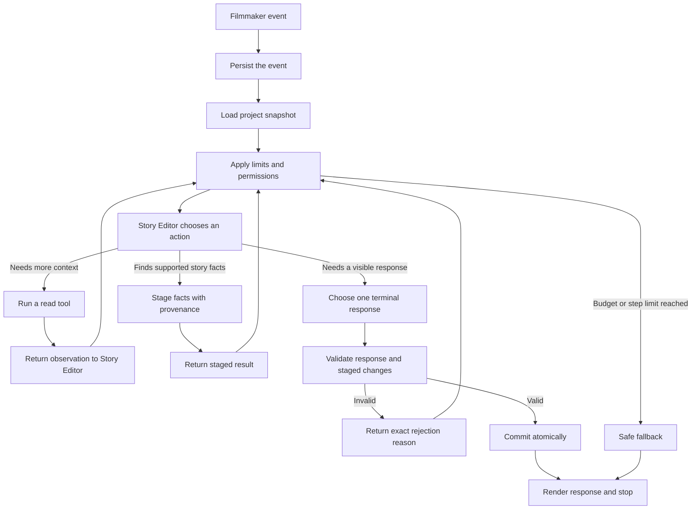

# Second Unit — Agentic Short-Film Harness

**Working product vision**  
**Updated:** 2026-09-01

## 1. The idea

Second Unit is an agentic production harness that stays with a filmmaker from
the first story idea through a production-ready short film.

It is not only a chatbot and it is not a one-click film generator. It is a
persistent workspace that remembers the film, understands the current stage,
keeps creative and production decisions connected, and helps the filmmaker
decide what to do next.

The product flow is:

```text
Interview
→ Outline
→ Screenplay
→ Scene breakdown
→ Shooting schedule
→ Shot list
→ Production readiness
→ Continuous deadline and shoot follow-through
```

The central promise is:

> Second Unit remembers the entire film, understands what every change affects,
> and keeps the production moving from the first idea toward the shoot.

## 2. Product principles

### 2.1 The filmmaker remains the authority

AI suggestions are not decisions. Generated work is not automatically approved.
The application must always distinguish:

```text
Suggested → Accepted → Approved → Scheduled → Completed
```

### 2.2 Assistance should reduce blank-page work

The filmmaker should not be forced to invent every answer from nothing. When a
meaningful creative fork exists, the assistant can present two or three concrete
possibilities as selectable cards. The user may choose one, combine several,
reject them, or add a note.

### 2.3 Approved artifacts are protected

Approved outlines, screenplays, schedules, and shot lists are never silently
rewritten. A change creates a new working state and requires review again.

### 2.4 Changes must propagate

If Scene 8 changes from a night exterior to a day interior, the system should
recognize that the breakdown, schedule, equipment plan, shot list, and readiness
report may now be stale.

### 2.5 Deterministic rules beat AI judgment where possible

Deadline calculations, task status, dependency checks, page totals, and missing
legal or safety requirements should be calculated by code. AI should explain
the implications and propose remedies, not redefine the rules.

## 3. The Interview stage

The Interview is the first creative workspace. Its purpose is to help the
filmmaker discover and clarify the film without becoming either an interrogation
or an automatic story generator.

### 3.1 What a good Interview agent feels like

A good Story Editor can:

- ask one sharp, contextual question
- reflect what it thinks the writer means
- notice contradictions or unresolved decisions
- offer coaching when the writer is stuck
- provide two or three selectable suggestions when useful
- explain how each suggestion changes the film
- remember the complete conversation
- avoid repeating questions
- assess whether enough visible scene material exists
- recommend moving to an outline at the right time

It should not ask questions simply because character, conflict, theme, and
structure are common screenplay categories. It should follow the specific
material in front of it.

### 3.2 Storytelling format

Before the interview, the filmmaker chooses an initial storytelling preference:

- Narrated
- Dialogue-led
- Hybrid
- Not sure yet

This choice guides the interview but is not permanently locked. Once the outline
exists, the Screenplay stage can reassess which form actually serves the film.

### 3.3 Creative involvement

The involvement control defines the collaboration style:

| Mode | Interview behavior | Outline behavior |
|---|---|---|
| AI-led | Short interview, proactive suggestions | May develop missing material and disclose additions |
| Collaborative | Questions plus regular selectable possibilities | May bridge minor connective gaps and disclose them |
| Author-led | Writer makes consequential choices; help remains available | Uses accepted writer material and leaves major gaps visible |

The default should feel collaborative rather than restrictive.

### 3.4 Response types

The Story Editor can return four response types:

1. **Question** — one focused question grounded in the latest answer
2. **Reflection** — a concise interpretation for the writer to confirm or reject
3. **Coaching** — guidance about why a choice matters
4. **Suggestions** — two or three selectable creative possibilities

Suggestions should be structured UI objects rather than buried inside prose:

```text
Ideas to consider

☐ Keep the confrontation public
  Social pressure makes silence more costly.

☐ Move it somewhere private
  Isolation makes the same conflict more threatening.

☐ Delay the confrontation
  Suspense comes from what both characters avoid saying.

[Use selected ideas and continue]
```

Selecting a suggestion makes it part of the writer's response. Until then, it
remains a proposal and must not appear in the established story facts.

### 3.5 Interview memory

The Story workspace shows the complete conversation:

- starting idea
- assistant questions
- reflections and coaching
- suggestions shown
- suggestions selected
- writer answers
- skipped decisions
- established facts
- unresolved critical gaps
- readiness assessment and explanation

The conversation is stored as project state. It is not dependent on the visible
browser session or on an LLM remembering earlier calls.

### 3.6 Interview readiness

Readiness asks whether the current material can support an honest scene outline.
It considers:

- whose actions carry the film
- what creates pressure or change
- whether there is a visible sequence of events
- whether the ending or final image is sufficiently understood

It should not behave like a progress bar that only increases. A new answer can
reveal a genuine gap, but a large decrease requires a concrete explanation.

When enough material exists, the assistant should say:

> You have enough for a first outline. You can review it now or continue
> developing the story.

This is clearer than exposing internal safety-limit language.

### 3.7 Ideal agentic loop for the Interview

The Interview should use a bounded agent loop. The Story Editor decides what
kind of help is most useful, but the surrounding harness controls memory,
validation, permissions, cost, and persistence.

The global Production Supervisor may start or resume the Interview workflow,
but it should not make the creative decisions inside the conversation. Those
belong to the Story Editor.

#### 3.7.1 Execution boundary

One loop runs in response to one filmmaker event and produces no more than one
visible assistant response. It must then stop and wait for the filmmaker.

An event can be:

- starting a new interview
- submitting an answer
- selecting one or more suggested ideas
- pressing **Give me options**
- asking for explanation or coaching
- skipping a question
- choosing to continue after the story becomes outline-ready

The Interview agent does not keep talking to itself in the background. Any
internal tool use happens within the bounded run caused by one of these events.

#### 3.7.2 State loaded before every run

The harness gives the Story Editor a project snapshot containing:

- the original story idea
- storytelling format and creative-involvement mode
- recent conversation turns
- the searchable full conversation history
- established story facts with their source turn
- suggestions shown, selected, rejected, or still undecided
- open questions, contradictions, and critical gaps
- questions already asked
- readiness history and its explanations
- the latest filmmaker event

The snapshot, not the model's memory, is the source of truth.

#### 3.7.3 Loop flow



##### 3.7.3.1 Step descriptions

| Step | Description |
|---|---|
| **A. Filmmaker event** | A writer starts the Interview, answers, skips, selects an idea, requests options, asks for help, or chooses to continue. |
| **B. Persist the event** | Save the filmmaker's exact action before calling the model so it cannot be lost if the run fails. |
| **C. Load project snapshot** | Assemble the latest format, involvement mode, transcript, accepted facts, suggestions, gaps, readiness, and prior questions. |
| **D. Apply limits and permissions** | Check the allowed tools, step budget, cost budget, response rules, and any hard routing caused by the event. |
| **E. Story Editor chooses an action** | Let the model select the single most useful internal tool or visible response based on the event and current story state. |
| **F. Run a read tool** | Retrieve missing history, inspect accepted state, check continuity, or optionally consult outcome rankings. |
| **G. Return observation** | Add the tool result to this run's context so the Story Editor can make its next decision with better evidence. |
| **H. Stage facts with provenance** | Prepare supported facts or gap changes and attach their source turn without changing canonical state yet. |
| **I. Return staged result** | Tell the Story Editor what was successfully staged or why a proposed change was rejected. |
| **J. Choose one terminal response** | Finish with exactly one action: ask, offer suggestions, reflect, coach, or recommend the Outline. |
| **K. Validate response and changes** | Check intent, question quality, suggestions, provenance, contradictions, authority, readiness, and output structure. |
| **L. Return rejection reason** | Explain the exact validation failure to the Story Editor so it can correct the action within the same run. |
| **M. Commit atomically** | Save the response, accepted staged changes, readiness, and run record together as one database transaction. |
| **N. Render response and stop** | Show the single response to the filmmaker and wait for the next human event. |
| **O. Safe fallback** | Preserve the filmmaker's input, discard uncommitted changes, and return a safe local question or retry action when limits or providers fail. |

The important distinction is that a rejected action returns a useful reason to
the agent. It can correct only that action instead of regenerating and losing
the entire turn.

#### 3.7.4 Tools available to the Story Editor

These are small, typed Python capabilities exposed to the Story Editor. The
model requests a tool; the harness validates the arguments and runs it. They are
not separate agents, and most do not need an external service or MCP server.
This is the intended tool contract; the complete set is not implemented yet.

##### 3.7.4.1 Read and analysis tools

| Tool | How it helps | Important behavior |
|---|---|---|
| `get_story_state` | Returns the current accepted facts, open gaps, format, involvement mode, readiness, and latest activity. It lets the agent orient itself before deciding what matters next. | Read-only and structured; the database remains the source of truth. |
| `search_interview_history` | Searches the complete conversation for a character, event, image, earlier answer, or decision. It supplies only relevant turns instead of placing the entire transcript in every prompt. | Returns exact excerpts and turn IDs; it never summarizes them into new facts. |
| `check_continuity` | Compares a new answer or proposed fact with accepted story state and identifies conflicts or affected decisions. | Reports the conflict but never chooses which version is correct. |
| `rank_next_focus` | Uses anonymized past outcomes to suggest which unresolved focus may produce a useful next turn. | Optional, cached, and weak evidence only; Grafana failure must not block the Interview. |

##### 3.7.4.2 State-staging tools

| Tool | How it helps | Important behavior |
|---|---|---|
| `stage_story_fact` | Prepares one concise story fact using a writer answer or selected suggestion as evidence. It returns the proposed fact and its source turn for validation. | Cannot promote an unselected AI idea, and does not save anything until the full run commits. |
| `stage_gap_change` | Opens, updates, or resolves a specific uncertainty such as an unclear ending or conflicting character goal. | Resolving a gap requires supporting evidence; all changes remain temporary until commit. |

##### 3.7.4.3 Terminal response tools

Each terminal tool creates the one response shown to the filmmaker and then
stops the loop.

| Tool | How it helps | Required output and guardrail |
|---|---|---|
| `ask_question` | Moves the story forward by requesting the single most valuable missing action, image, choice, or consequence. | One contextual question plus what it is listening for; no repeated or compound questions. |
| `offer_suggestions` | Helps when the filmmaker requests options or would benefit from concrete directions instead of a blank page. | Two or three checkbox ideas, each with a dramatic consequence; none becomes fact until selected. |
| `reflect_and_confirm` | States what the agent believes the filmmaker means so misunderstandings can be corrected early. | A short interpretation and a confirm, reject, or edit invitation; uncertain interpretation is not canonical. |
| `coach_writer` | Answers a direct question or briefly explains why a creative choice matters, then offers a manageable next step. | Advice stays separate from story facts and may contain no more than one follow-up question. |
| `recommend_outline` | Explains that the material can support an outline and lets the filmmaker choose what happens next. | Gives concrete readiness evidence and **Build outline** or **Keep developing** actions; it never starts the Outline automatically. |

The read and staging tools may repeat inside one run. A terminal tool may be
called only once. All staged changes use a temporary transaction and become
canonical only when the terminal response and the complete transaction pass
validation.

#### 3.7.5 Decision policy

The Story Editor chooses its next action in this order:

1. Honor the filmmaker's explicit request.
2. Incorporate the latest answer or selected suggestions.
3. Surface a contradiction before building more material on top of it.
4. Address the highest-impact gap preventing visible scenes.
5. Offer concrete help when the filmmaker appears stuck or uncertain.
6. Recommend an outline when the material is ready.

Some event types impose hard routing rules:

| Filmmaker event | Required behavior |
|---|---|
| **Give me options** | Must call `offer_suggestions`; a plain question is invalid |
| Selects suggestions | Treat selections as accepted input, preserve attribution, and continue from them |
| Rejects all suggestions | Record the rejection so substantially similar ideas are not immediately repeated |
| Asks a direct question | Answer or coach first; do not ignore it in favor of another interview question |
| Gives a vague answer | Reflect the understood part, then ask for one concrete action, image, or choice |
| Contradicts an earlier fact | Ask which version should be retained; never overwrite silently |
| Skips | Mark the question skipped and choose a different useful direction |

#### 3.7.6 Response validation

Before anything is shown or saved, the harness checks that:

- there is only one main question
- the question is not a repeat or light rephrasing of a recent question
- the response follows the filmmaker's explicit request
- suggestions contain two or three distinct checkbox options
- each suggestion explains its effect on the film
- unselected suggestions are not stored as established facts
- every staged fact points to a writer answer or accepted suggestion
- contradictions are surfaced rather than silently resolved
- the response respects the selected creative-involvement mode
- readiness includes a specific explanation
- no internal error, model failure, budget message, or safety-limit language is
  shown as creative guidance

If validation fails, the reason goes back into the loop. The Story Editor gets
another opportunity within the same run to choose a valid action.

#### 3.7.7 Limits and fallback

Recommended starting limits for one filmmaker event are:

- no more than four model steps
- no more than one optional external ranking call
- a configurable token and cost budget checked before every model call
- one committed terminal response

If a provider, tool, or budget fails, the fallback should preserve the writer's
latest input and avoid committing partial facts. It may show a locally generated
question or a simple retry action.

Interview length targets are pacing guidance, not forced completion. AI-led mode
may recommend outlining sooner than Author-led mode, but the writer can always
continue. Hard limits belong around each internal agent run, not around the
number of answers a filmmaker is allowed to give.

#### 3.7.8 Commit and memory

A successful run is committed as one transaction containing:

- the filmmaker event
- internal tools called and observations returned
- the visible assistant response
- suggestions and their current status
- accepted facts and their provenance
- gap changes
- readiness and its explanation
- model, token, cost, latency, and fallback metadata

This makes a turn reproducible and prevents half-applied updates when a later
step fails.

#### 3.7.9 Finishing the Interview

The Story Editor may call `recommend_outline` when it can identify:

- who or what carries the film
- the pressure, desire, or change driving it
- enough visible events to arrange into scenes
- a plausible final change, consequence, or image
- no unresolved contradiction that would materially change the outline

This changes the Interview state from **Active** to **Ready for outline**. It
does not automatically generate or approve the outline.

The filmmaker is shown two clear actions:

```text
[Build the first outline]   [Keep developing the story]
```

Only the filmmaker's first choice starts the Outline workflow. The second
choice returns the Interview to **Active** without losing its readiness history.

#### 3.7.10 Example run

```text
Filmmaker: I still do not know the ending. Give me options.

1. The harness saves the request_suggestions event.
2. The terminal action is restricted to offer_suggestions.
3. The Story Editor searches the established ending-related facts.
4. It stages no new facts because the writer has not selected anything yet.
5. It offers three endings, each with a different dramatic consequence.
6. The validator confirms that the options are distinct and selectable.
7. The response is committed and the loop stops.

Filmmaker selects option 2.

8. A new loop saves the selection as accepted writer input.
9. The Story Editor stages the selected ending with its suggestion and selection
   events as provenance.
10. It asks one question about the visible final image needed to make that ending
    playable.
11. The fact, question, and run record are committed together.
```

#### 3.7.11 Recommended implementation order

1. Move interview turns, facts, gaps, suggestions, and readiness into SQLite.
2. Wire the existing budget and run recorder around every model call.
3. Replace the single large model response with the bounded tool loop.
4. Enforce user intent in code, especially **Give me options**, direct questions,
   and **Continue interviewing**.
5. Add evaluation conversations for repetition, invention, contradiction,
   suggestion quality, and appropriate outline recommendations.

The first working slice should be:

```text
User event
→ Load SQLite story state
→ Story Editor chooses a tool
→ Validate the tool call
→ Commit the response and supported facts together
→ Stop and wait for the filmmaker
```

This should remain one Story Editor agent. A second agent reviewing every turn
would add cost and latency; deterministic validation and repeatable evaluation
are more useful at this stage.

## 4. Future workflow overview

The current build scope ends with a strong, persistent Interview agent. Later
stages remain part of the product direction, but are intentionally not designed
in detail yet:

1. **Outline** — organize accepted Interview material into editable scenes and
   require filmmaker approval.
2. **Screenplay** — decide the narrative form, establish drafting authority, and
   write a versioned script from the approved story.
3. **Breakdown** — extract and confirm the cast, locations, props, wardrobe,
   equipment, safety needs, and other production elements.
4. **Schedule and shot list** — turn confirmed requirements into shoot days and
   prioritized visual coverage.
5. **Readiness and follow-through** — track blockers, deadlines, approvals, and
   changes through the shoot.

These later stages will use the same principles proven by the Interview:
canonical SQLite state, bounded workflows, traceable changes, validation,
explicit approvals, and one clear assistant for the filmmaker.
