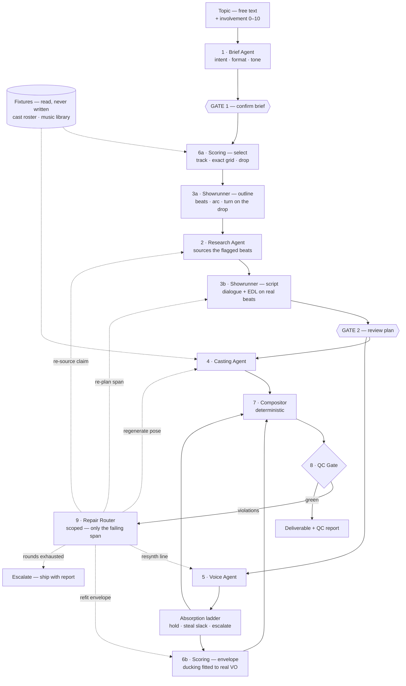
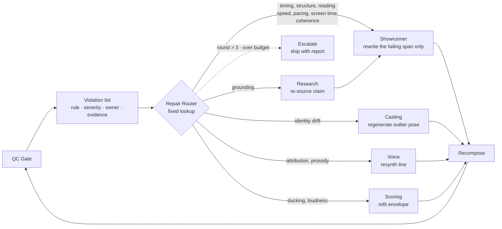
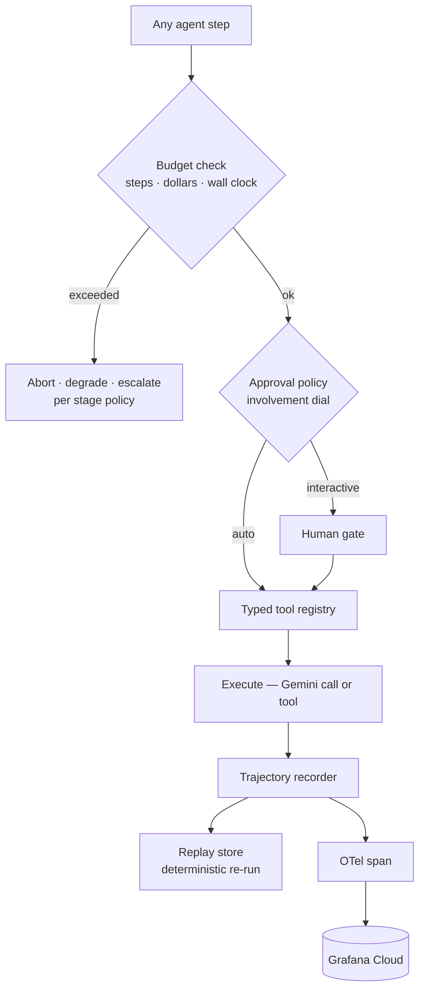
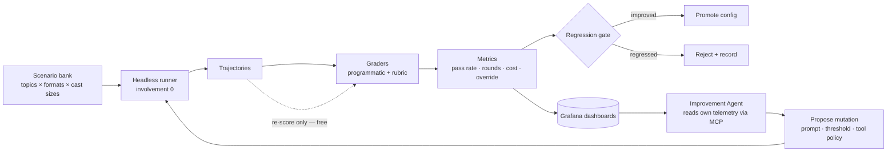

# Second Unit — Architecture

> An agent harness that produces short-form video and proves it meets spec.
> Seven agents, two dial-governed gates, one deterministic compositor, and a QC loop that decides when the thing is done.
> **The generated video is the output. The pass rate is the product.**

| | |
|---|---|
| **Stack** | Gemini · Imagen · Gemini TTS · ffmpeg |
| **Partner track** | Grafana Cloud, via MCP |
| **Budget** | $100 total credit · `$0.110` per run |
**This is the single authoritative document.** It absorbed and replaced `AGENTS.md` and `architecture.html`, both of which were removed — they remain in git history if anything needs recovering. `README.md` is the short public pitch and is not a design document.

**Status key:** ⬜ open · 🟡 in design · ✅ locked · 🔒 immutable by constraint

### Where this stands

| | |
|---|---|
| ✅ | Design locked across all seven agents, with the full decision log in [Appendix A](#appendix-a--decision-log) |
| ✅ | Grafana MCP reachable from Gemini; Imagen and TTS quota confirmed |
| ✅ | **Compositor proven** — 30fps sprite compositing, the 5Hz mouth cycle, beat-accurate cuts, determinism |
| ✅ | **Harness core** — budget enforcer, trajectory recorder, closed tool registry, scope guard |
| ✅ | **Pipeline runs end to end** — declared topology, gates suspending on a generator, repair loop closing, `beat_alignment` and `duration_adherence` live |
| ✅ | Model client behind one interface; Vertex and AI Studio are one env var apart |
| ⬜ | Credentials, then the grounding probe — replay depends on citation metadata surviving |
| ❌ | **The pre-scored music library does not exist.** Synthetic fixtures stand in. Every planning stage depends on the real thing. |
| ⬜ | Nine of eleven QC rules unimplemented |

---

## Contents

1. [What we're building](#1--what-were-building)
2. [Four load-bearing decisions](#2--four-load-bearing-decisions)
3. [The pipeline](#3--the-pipeline)
4. [The agents](#4--the-agents)
5. [Deliberately not agents](#5--deliberately-not-agents)
6. [Contracts between stages](#6--contracts-between-stages)
7. [QC rules and repair routing](#7--qc-rules-and-repair-routing)
8. [The harness](#8--the-harness)
9. [Cost model](#9--cost-model)
10. [Evaluation and self-improvement](#10--evaluation-and-self-improvement)
11. [Order of work](#11--order-of-work)
· [Appendix A — Decision log](#appendix-a--decision-log)
· [Appendix B — Open questions](#appendix-b--open-questions)

---

## 1 · What we're building

### The goal

Give the system a topic. It proposes what kind of video that should be — intent, format, tone, duration — and you accept or change it. Then it researches the subject, writes the script, voices the speakers against a real beat grid, generates the backgrounds, cuts to the music, and runs eleven automated quality checks, repairing its own mistakes until the result passes.

The interesting output is not the video. It is the **pass rate**: the share of runs clearing every check that applies to them, tracked per intent and format, over time, as the system is tuned.

### The problem, at two altitudes

**For creators**, short-form video is assembled, not authored. Someone writes a script, records voice, finds footage, picks music — and then spends the real hours on the mechanical part. Making cuts land on beats. Keeping captions readable. Keeping music out of the way of the voice. Hitting a platform's duration and loudness spec. That work is tedious, unglamorous, and it is where the time goes.

**For agent systems**, generating a plausible video is easy and generating a *correct* one is not. Almost every AI video tool produces one output and hopes. Nothing checks whether the cuts are on the beat, whether the captions can be read at that speed, whether the character in shot 6 is the same person as in shot 2, or whether the script's claims trace to anything real. Without those checks there is no way to say whether the system is improving — only whether the last demo looked good.

**This project treats the second problem as the interesting one.**

### What makes it different

| | Typical generator | This |
|---|---|---|
| Output | An `.mp4` | An **edit decision list**, rendered deterministically |
| Quality | Whatever came out | Eleven checks, nine of them free arithmetic |
| On failure | Ship it anyway | Route the violation to the agent that caused it, repair, re-check |
| Characters | Regenerated per shot, drift visible | **A fixed roster, drawn once and reviewed** — drift impossible by construction |
| Planning | One prompt, one guess | A proposed plan you can edit before anything is spent |
| Evidence it works | A good-looking demo | Pass rate across a scenario bank, tracked over time |

The consequence is that the system can answer a question most agent demos can't: **is it actually improving, and by how much?**

### Intent, format, tone

A vague prompt — *"make a video about AI agents"* — admits many fundamentally different videos. The system resolves that into three separate choices, proposes all of them at once, and lets the user change any of them.

**Intent — what the video is trying to accomplish.** Three, closed. Each puts `grounding` into a different regime, which is what makes them worth distinguishing rather than merely worth naming.

| Intent | Grounding regime | Absorbs |
|---|---|---|
| **Explainer** | Most claim-bearing beats sourced | Education · News · Informational |
| **Comedy** | Few or no sourced beats — a low score is *correct* | Skits, bits, satire |
| **Commentary** | Claims are arguable; sources support a position | Opinion, analysis, hot takes |

> **Why not Education / News / Informational as separate intents.** In a 45-second reel they are the same video: all factual, all fully researched, all scoring identically on every one of the eleven rules. Separating them spends sweep budget to discover they are one cell. **Commentary earns the third slot because it is the only intent where a claim can be contested *and* sourced** — a third grounding regime rather than a second label on the first.

**Format — how the idea is presented.** Two, closed.

| Format | Cast | Constraints |
|---|---|---|
| **Monologue** | 1 | VO-continuous, hook ≤ 3s, one idea per shot |
| **Debate** | 2 | Turn-taking 3–9s, opposing positions, tension escalating to the drop |

> **Cut from five.** Podcast and Interview were both "two people talking" variants of Debate with near-zero marginal insight. Skit was the 3-cast outlier that also scored worst on grounding — and Comedy now covers that ground as an *intent*, playable in either format. Two formats preserve the cast-size curve (1 vs 2), which is the finding worth having, at 40% of the surface.

**Tone — how it should feel.** Engaging · Professional · Funny · Dramatic · Casual. A product field with **no sweep of its own**: tone does not change whether cuts land on beats, so it earns a user choice but not a cell in the grid.

**Everything is closed and everything is tunable within its range.** Brief cannot invent a fourth intent or a third format — that is what keeps pass rate comparable. What it *can* do is set parameters inside a configuration's legal range, and the QC rules read their thresholds from `brief.params` rather than from constants.

**The intent is a bundle of parameter defaults, not a label:**

```
Comedy                            Explainer
  needs_fact:  few beats            needs_fact:  most claim-bearing beats
  pacing:      faster, shorter      pacing:      steadier
  drop      =  punchline            drop      =  the "aha"
  tone      →  funny                tone      →  engaging
                                    requires a takeaway beat
```

### What gets measured

| Metric | What it tells you |
|---|---|
| QC pass rate, **per intent × format** | Whether the planner handles complexity. Never pooled across intents — see below. |
| Repair rounds to green | Planning quality, directly. A better Showrunner needs fewer rounds. |
| Cost per finished reel | Whether the system is getting cheaper as it gets better. Doubles as the budget instrument. |
| Override rate at each gate | How often a human changes what was proposed. Points at the weakest judgment in the system. |
| Violation frequency by rule | Where to aim the next improvement. |
| Background plates per reel | The only per-run image cost, so the single largest lever on cost per reel. |

> 🔒 **Pass rate is reported per intent and never pooled across intents.** Because intents carry different thresholds — Comedy's grounding bar is lower than Explainer's — a pooled number can be raised without improving anything, simply by classifying more topics as Comedy. Brief picks the intent, so a pooled metric hands Brief a lever on its own grade. Per-intent reporting closes it: misclassification moves runs between buckets and lifts nothing. **This is the same class of failure as a mutable grader** ([§10](#-it-cannot-touch-what-grades-it)) and deserves the same structural treatment.

---

## 2 · Four load-bearing decisions

Everything downstream follows from these. If one changes, the architecture changes.

### 2.1 · The EDL is the artifact, not the video

Agents produce an edit decision list — shots with in/out points, VO segments with timing, a music track with a marked drop, caption spans, an intensity envelope. The video is a deterministic render of that document.

This makes evaluation cheap (most checks run on the plan, no pixels generated), makes the agent's reasoning diffable, and makes re-targeting to another platform a re-render rather than a re-generation.

### 2.2 · Characters are a fixture, backgrounds are the variable

**The cast is established once, outside the pipeline, and reused by every video. Backgrounds are generated fresh on every run.** That split is the core of the asset model, and it follows from the format catalog: no reel has more than three speakers, and a creator making fifty videos wants the same faces in all of them.

**Setup — runs once, not per video.** The user asks for one to three characters, is shown candidates, picks or re-prompts until satisfied, and the accepted characters are drawn out to a full pose set and stored. Nine drawings per character — eight poses plus a mouth-open variant. From then on the roster is a fixture: video generation *references* characters, it never creates them. Changing a character later is a separate management action, deliberately outside the video flow.

**At runtime**, characters are animated by arithmetic — a 5Hz talk cycle gated by audio amplitude, a sine bob at idle, scale pulses on emphasis, hard cuts on beats. Identity consistency becomes structural instead of probabilistic, and now across the whole channel rather than just within a reel.

Three consequences worth naming:

- **Character generation leaves the per-run budget entirely** — not as an accounting carve-out for cold archetypes, but because it genuinely happens somewhere else. Every run then costs the same, which makes sweep forecasting exact.
- **The human is in the loop where visual judgment actually matters**, once, rather than never. This is not a gate and is not governed by the involvement dial — it happens before any run exists.
- **The eval sweep gets a stable cast fixture**, seeded once. A hundred runs share three characters, so the denominator holds still while everything else varies.

This gives the project two pre-established asset libraries with the same shape: the **music library**, scored offline, and the **cast roster**, generated at setup. Both are lookups at runtime. Both are prerequisites for a run. The only images generated during a video are backgrounds.

**The cost consequence is the one that matters at a $100 ceiling: output frame rate is free.** Frames are composited by ffmpeg on CPU, so 24, 30 and 60fps cost exactly the same. Nothing is generated per frame, per second, or per shot. The only thing that costs money is a *distinct drawing*, and there are six per character, reused across every reel that casts the same archetype.

**Renders run at 30fps**, chosen on how it divides rather than on cost: a 3-frame mouth hold lands the talk cycle at 5Hz, inside the natural syllable band, and divides evenly so the alternation never judders. The frame rate is pinned in config and recorded per run, because it changes the output bytes and *same EDL → same bytes* has to keep meaning something.

> **Frame duration is a floor on beat-alignment precision.** Cuts quantize to frame boundaries, so at 30fps a cut can sit ±16.7ms off its beat no matter how good the planner is. That is a quarter of the 60ms threshold — fine. Tighten the threshold below ~35ms and the frame rate becomes the limiting factor rather than the Showrunner, at which point the rule measures the encoder. 60fps halves the error if that headroom is ever needed, and costs only ffmpeg time.

Because the roster is fixed, sprite reuse is total: a three-character roster is **27 drawings for every video the project will ever make**, which is what makes hundreds of runs affordable — and what makes a rich pose set free to ask for.

**Backgrounds are generated fresh on every run, and are the only images a run generates.** A background picked from a library cannot be *about* anything — a reel on the Taj Mahal would never show it. Since the cast is now a fixture, backgrounds are also where all the visual variety has to come from, so **deliberately no cross-run reuse**: two reels on the same topic should not look like the same video.

The failed version of this was *per-shot* generation: 8–12 near-unique descriptions per reel. Two changes make it affordable without reintroducing sameness:

- **A reel gets `bg_budget` distinct plates, default 3** — not one per shot. Both formats are single-location by construction, so the budget buys *subject* changes rather than room changes: what the characters are discussing, not where they are standing.
- **The Showrunner emits a reusable `scene_id`**, and every shot in that location references it. Deduplication happens **within a reel only** — nine shots across two scenes cost two generations, not nine — and one wide plate per scene is cropped and panned per shot, which reads as different setups for free.

`--bespoke-bg` now means the opposite of what it used to: it *lifts* the cap for the handful of reels a human actually watches, allowing genuine per-shot generation.

> **This is the one place the design deliberately spends for variety rather than saving for cache.** Within-reel dedupe is continuity — the room must not change mid-conversation. Cross-run dedupe would be savings, and is refused on purpose.

### 2.3 · Gates sit where changes are cheap and consequences are expensive

Two hard gates: after the brief, and after the plan. Both operate on text. Everything downstream of the second gate runs autonomously under automatic QC. Per-shot approval is deliberately absent — it is too granular to be useful and it destroys the ability to run unattended.

> **One knowing exception.** Music selection runs *before* Gate 2, because the Showrunner needs a real beat grid to cut against. Gate 2 is therefore no longer strictly upstream of all asset spend. Acceptable because the track comes from a pre-scored library — the selection is a lookup, not a generation — but it is a deliberate softening of this principle rather than an oversight.

### 2.4 · Every gate has an auto-approve path — and one dial controls them all

A system that requires a human cannot be evaluated, and the evaluation harness is the reason this project is worth building.

The mechanism is a single run-level integer, **`involvement: 0–10`**, resolving to a question budget and a confidence threshold. Each agent scores its own confidence per field and asks about the least-confident ones until the budget runs out. Everything unasked is decided and shown as an editable assumption chip.

| Dial | Question budget | Ask if confidence below | Gate 1 | Gate 2 | Feels like |
|---|---|---|---|---|---|
| **0** | 0 | — | silent | silent | Vending machine — topic in, video out |
| **3** | 1 | 0.35 | ~1 q | ~1 q | Asks only when genuinely stuck |
| **5** | 2 | 0.60 | ~2 q | ~2 q | Asks about the one or two real forks. **Default.** |
| **8** | 4 | 0.85 | ~4 q | ~4 q | Checks most creative calls with you |
| **10** | 6 | 0.99 | ~6 q | ~6 q | Collaborator — confirms nearly everything |

```
involvement → (question_budget, ask_threshold)
              ↓
  fields ranked by confidence, ascending
              ↓
  ask about fields where conf < ask_threshold,
  stopping at question_budget
              ↓
  everything unasked is decided and shown
  as an editable assumption chip
```

**`involvement: 0` is not a headless mode. It is the same agent, asking zero questions.** The eval sweep runs at 0 and the product ships at 5, with no second code path to drift out of sync. The delta between them — how often a human overrides what auto-approve accepted — becomes a first-class metric, and plotting override rate *against* the dial points straight at the weakest judgment in the system.

Even at 10, unasked fields still appear as chips. The dial controls what gets asked *proactively*; the gate always shows everything decided.

---

## 3 · The pipeline

### Two prerequisites, established before any run

Neither is a pipeline stage. Both are fixtures a run *reads*, and a run cannot start without them.

| Fixture | Built | Contains | State |
|---|---|---|---|
| **Cast roster** | Once, at setup, with the user in the loop | 1–3 characters × 9 sprites | ⬜ Not built |
| **Music library** | Once, offline | Tracks with verified beat grids and drop positions | ❌ **Missing** — see [§11](#11--build-order) |

> **The music library is the live blocker.** Scoring 6a is the first stage of every run and it is a lookup into this library; the Showrunner then cuts against the grid it returns. Without it there is no grid, so there is no `beat_alignment`, so the headline metric has nothing to measure. **The compositor spike does not need real music** — synthetic audio at a known BPM gives an exact grid by construction — but nothing past the spike works until the library exists.

### The run

One request, end to end. Solid edges are the forward path; dashed edges are feedback. The only cycle in the system is the QC repair loop — everything else is a straight line, which is what keeps it debuggable.



**Three orderings are load-bearing, and each was chosen against an obvious-looking alternative.**

> **Scoring runs first, before anything is planned.** The Showrunner cuts to a beat grid, and that grid has to be real. Because tracks come from a pre-scored library, their grids and drop positions are fixed and verified before any run touches them — so beat alignment is checked against ground truth. Every `beat_alignment` failure is then a genuine planning failure, never beat-detection error. Scoring also *proposes* the drop from the track's own structure, and the outline places its emotional turn there: the story lands on a real musical event instead of an arbitrary timestamp.
>
> **To be clear about what "pre-scored" forbids:** it rules out detecting beats at *runtime*, on audio the system just generated. Detection **offline, once, then verified by ear and corrected** is exactly how the library gets built — the grid is ground truth because it has been checked, not because a detector never touched it. `librosa.beat.beat_track()` plus a listening pass is the intended workflow.

> **Research sits between the Showrunner's two passes.** You cannot know which facts you need until you know what the script is about. The outline flags beats as `needs_fact`; Research sources exactly those. Researching the topic broadly first spends money on claims the script never uses, and quietly lets whatever the search surfaced dictate the story.

> **The edge people forget — and it is not an agent edge.** Synthesized speech is never the length you estimated. But the correction is arithmetic, not judgment: real durations replace estimates, an underrun holds the last frame, an overrun steals slack from neighbouring pauses, and cuts snap to the nearest real beat. Only when drift exceeds `max_hold_s` does a model get called — and then it rewrites *that line only*. Without this the cuts drift off the grid and alignment fails on every run, for a reason that has nothing to do with planning quality.

---

## 4 · The agents

Seven agents. Six make a video, one improves the other six. Each earns its place by owning a decision the others cannot make.

| # | Agent | Owns the decision | Loop | Repair inbox |
|---|---|---|---|---|
| 1 | [Brief](#41--brief-agent) | Intent, format, tone — what kind of video this should be | Shallow | **None** — gated |
| 2 | [Research](#42--research-agent) | What is true and where it came from | Deep | `grounding` |
| 3 | [Showrunner](#43--showrunner) | What gets said, by whom, where cuts land | Shallow + Deep | **6 of 11 rules** |
| 4 | [Casting](#44--casting-agent) | What the scene looks like, and that the cast still matches the roster | Medium | `identity_drift` |
| 5 | [Voice](#45--voice-agent) | How each line sounds and how long it really takes | **None** on hot path | `speaker_attribution` |
| 6 | [Scoring](#46--scoring-agent) | The track, the grid, the drop, the ducking | None + Shallow | `music_ducking` · `loudness_spec` |
| 7 | [Improvement](#47--improvement-agent) | Which knob to turn next, and why | Offline | n/a |

**Every agent is the same shape.** Input (a typed document — never free text after stage 1), output (a typed document), tools (from a fixed registry — no agent gets an open-ended tool), loop depth, trigger, repair inbox, budget, failure mode. An agent needing an exception to this shape is a design decision worth writing down.

**Two agents run twice rather than being split into four.** The Showrunner's outline and script passes share a prompt and a metric — splitting them would double the surface the Improvement Agent has to search for half the attribution benefit. Scoring's two passes are forced apart by ordering, not by skill: the grid is needed before planning, and the ducking envelope cannot exist until the VO spans do.

---

### 4.1 · Brief Agent

**The producer taking the order.** You type "make a video about AI agents"; it proposes *Commentary · Debate · Wry · 45s*, with the cast, voices and visual direction already chosen. Turns a vague topic into a complete spec sheet.

**It proposes a whole plan, not a questionnaire.** Every field is decided and shown as an editable chip — the user accepts the lot or changes any part of it. The involvement dial governs only whether Brief *additionally* interrupts to ask about its least-confident fields; the gate always shows everything regardless. There is no wizard, and no field is ever withheld pending an answer.

| Slot | |
|---|---|
| **Input** | Topic string + `involvement: 0–10` |
| **Output** | Brief document ([§6](#6--contracts-between-stages)) |
| **Tools** | `intent_catalog` · `format_catalog` · `topic_probe` · `duration_policy` |
| **Loop depth** | Shallow — one probe, one decision call |
| **Called when** | First, always |
| **Repair inbox** | **None.** Gated, never repaired — a bad brief is a failed run, not a repaired one. |
| **Budget** | `$0.005` · **abort** on breach |
| **Failure mode** | Picks the wrong format. Everything downstream is then competently executed against the wrong spec. |

**✅ Locked**

- **Closed format catalog, parameters tunable within it.** Keeps pass-rate-by-format comparable across runs while letting the planner adapt per topic.
- **QC thresholds read from `brief.params`, never constants.** A direct consequence of the above. Cheap now, expensive to retrofit.
- **One unconditional `topic_probe` before deciding.** Unconditional beats conditional-on-confidence: it is one cheap call, it makes the trajectory the same shape every run, and it means confidence is computed *after* seeing evidence rather than from the topic string alone.
- **Gate 1 auto-approves unconditionally.** No blocking validator. A malformed brief flows downstream and gets caught by QC as some other rule's violation — which stress-tests the rest of the system rather than hiding behind a guard.
- **Schema check runs but never blocks.** An illegal brief (`cast_size: 3` on a debate) would otherwise surface downstream as a *Showrunner* violation, and the Improvement Agent would aim its next mutation at the wrong prompt. So the validator runs and records only:

```yaml
brief_invalid: true
reason: "cast_size 3 illegal for format debate (allows 2)"
# run continues. QC violations on this run are tagged
# caused_by: brief, and excluded from the Showrunner's metric.
```

- **Users pin coarse fields only** — `format`, `duration_s`, `cast_size`. Everything creative stays Brief's to decide. Pinned fields are hard constraints, not hints.

> **Follow-on:** the scenario bank cannot use pinning to inject a known-good brief for eval isolation, since that needs *every* field. That is a harness concern instead — the runner injects a brief document and skips stage 1 entirely. Build it when the eval harness lands, not before.

---

### 4.2 · Research Agent

**The fact-checker.** Sources exactly the beats the outline flagged as needing a fact — not the topic broadly — so nothing is researched and discarded.

| Slot | |
|---|---|
| **Input** | Outline, with beats flagged `needs_fact` |
| **Output** | Claim ledger — ~6–10 checkable assertions, each with a source |
| **Tools** | Gemini grounded search · `contradiction_check` |
| **Loop depth** | Deep — one grounded call per open beat, iterating until every flagged beat is answered or declared unanswerable |
| **Called when** | Between the Showrunner's outline and script passes |
| **Repair inbox** | `grounding` → re-source the specific failing claim, not the ledger |
| **Budget** | `$0.020` · **degrade** on breach — ship fewer sourced claims and let `grounding` fail honestly |
| **Failure mode** | Sources a claim the script does not make, or misses one it does. |

**✅ Locked**

- **Claim bar = checkable assertions only.** Roughly 6–10 entries per reel. Small enough to actually read at Gate 2.
- **Runs for every intent including Comedy, graded uniformly.** No `if factual` branch anywhere. A Comedy reel scoring low on grounding is accepted as real signal — the intent sets how many beats get flagged `needs_fact`, so Research simply has little to source and costs ~$0. It is never skipped, and its output is never graded on a softer scale within an intent.
- **Gemini grounded search over hand-rolled search + fetch.** Less code, same stack constraint. **Requires the recorder to persist returned text and `groundingMetadata` verbatim** — retrieval will not reproduce next week, and replay breaks without it.

---

### 4.3 · Showrunner

**Writer and director — the most important agent.** Runs **twice**: an outline pass that structures the arc and flags what needs facts, then a script pass that writes dialogue and cuts against a real beat grid.

| Slot | 3a · Outline | 3b · Script |
|---|---|---|
| **Input** | Brief + beat grid + drop | Outline + claim ledger + grid |
| **Output** | Beats, arc, turn placement, `needs_fact` flags | Dialogue lines + EDL |
| **Tools** | `format_validator` · `beat_grid` · `shot_budget` | + `duration_estimate` |
| **Loop depth** | Shallow | **Deep** — iterates against the validator |
| **Budget** | `$0.010` · **abort** | `$0.025` · **degrade** |
| **Failure mode** | Arc doesn't land on the drop | Turns outside legal range; cuts off-grid |

**Repair inbox — six of the eleven rules.** Timing · structure · reading speed · pacing · screen-time balance · coherence. This agent absorbs the majority of all repairs, which is consistent with it owning the majority of the creative decisions.

**✅ Locked**

- **One agent, two passes — not two agents.** Half the prompt surface for the Improvement Agent to search. Split later only if the metrics justify it.
- **Retime is deterministic arithmetic, no model call.** See the absorption ladder under [Voice](#45--voice-agent). Free and reproducible. When the nudge cannot absorb the drift, the existing repair loop is the escalation path.
- **Cuts are planned against a real beat grid**, supplied by Scoring before the outline runs. Never against an estimate.

---

### 4.4 · Casting Agent

**The set designer and continuity supervisor.** Character *design* is not its job — that happens once at setup, before any video exists. At runtime Casting resolves the cast from the roster, generates the backgrounds, and verifies that what came out still looks like who it should.

| Slot | |
|---|---|
| **Input** | Cast roster references + EDL shot list with `scene_id`s |
| **Output** | Background plates, resolved sprite references, asset manifest |
| **Tools** | `imagen_generate` · `identity_distance` · `roster_lookup` |
| **Loop depth** | Medium — background generation and verification |
| **Called when** | After Gate 2, in parallel with Voice |
| **Repair inbox** | `identity_drift` → regenerate the **outlier pose only**, never the sprite set |
| **Budget** | ⬜ re-size — sprites are a lookup; `bg_budget` plates are the real cost · **degrade** |
| **Failure mode** | Backgrounds that don't match what the script describes, or a pose that drifts off its stored reference. |

#### 4.4.1 · Cast setup — once, outside the pipeline

No format in the catalog exceeds three speakers, so a roster of three covers every video the system can make. Establishing that roster is a **separate flow that runs once**, not a stage inside a run.

```
SETUP  (once per project)              RUN  (every video)
────────────────────────────           ──────────────────────
1. user requests 1–3 characters        Brief assigns roles from
2. pick from candidates, or                the existing roster
   re-prompt and pick again           Casting resolves refs — no
3. accepted → full pose set               character generation at all
4. stored to roster
```

**✅ Selection is two-phase, so rejection is cheap.**

A candidate costs **one drawing**, not nine. Only an accepted character gets drawn out to the full set.

```
phase 1   generate 3 candidate portraits per slot        3 images
          user picks one — or types a description
          and gets 3 more                                3 images per retry

phase 2   accepted portrait → 8 poses + mouth-open       9 images
          seeded from the portrait so the face holds
```

A user who settles immediately spends 12 images per character. A user who re-prompts twice spends 18. The alternative — generating the full set per candidate — would have cost 27 for the same two rejections, and the rejected work is pure waste.

⬜ **Open:** does re-prompting replace all three candidates, or keep the ones the user liked and refresh the rest? Keeping the liked ones is friendlier and no more expensive.

- **The user iterates until satisfied.** Character design is visual judgment a model should not finalise alone, and it is worth a human's time exactly once.
- **This is not a gate and is not governed by the involvement dial.** Gates sit inside a run; this happens before any run exists. The dial controls interruption during production, not project setup.
- **Changing a character later is a separate management action** — deliberately outside the video flow, so no run can silently alter the cast it is using.
- **The eval sweep uses a seeded fixture roster.** A hundred runs share three characters, holding the denominator still while topic and format vary.

**Consequences.** Character generation leaves the per-run budget outright — not as a carve-out for cold archetypes, but because it genuinely happens elsewhere. Every run then costs the same, which makes sweep forecasting exact. And identity consistency now holds across the entire channel, not merely within a reel.

> **What this replaces.** The earlier design generated sprites on demand, keyed on `hash(archetype, style, pose)`, with an opt-in `distinct: true` for bespoke looks and a ~95% cache hit rate across a sweep. A fixed roster reaches the same place more simply: the hit rate is 100% by construction, and the `distinct` flag disappears because every character is bespoke and reviewed. The cost carve-out for cold archetypes disappears with it.

#### 4.4.2 · Poses: one closed set of eight

Eight poses per character, plus a mouth-open variant of `talking`. The old five-pose set was sized for a world where each drawing cost money on every run; with a fixed roster that constraint is gone, and a richer set is what keeps a 35-second two-hander from looking repetitive.

```
speaking     talking          + talking_open  ← the 5Hz mouth cycle
listening    listening          neutral, attentive
             nodding            active agreement
             skeptical          brow raised, arms crossed
reacting     reacting           surprise, the turn
             laughing           for wry and comic registers
emphasis     gesturing          making a point
default      idle               sine bob
```

**`nodding` and `skeptical` are the two that earn their place immediately.** A debate is agreement and disagreement, and the old set could express neither — the non-speaking character had exactly one face for the entire reel.

**The extras mechanism is removed.** With eight core poses there is nothing a Showrunner-requested extra would add that justifies a second, variable-size enum. The pose list is now closed and identical for every character, which is what keeps the EDL validatable against a fixed enum *before any pixel is generated*.

**✅ Pose is derived, not chosen.** The dialogue line already carries `delivery: { emotion, emphasis[] }`. Pose selection is a deterministic lookup from that field, not a Showrunner decision:

```
emotion: dry        → skeptical
emotion: excited    → gesturing
emotion: amused     → laughing
non-speaking char   → nodding | skeptical | listening, from the
                      emotion of the line being spoken at them
```

Free, reproducible, and it keeps a decision that appears in every single frame out of a model's hands — consistent with everything else in [§5](#5--deliberately-not-agents). ⬜ The emotion→pose table itself is a good Improvement Agent mutation target.

#### 4.4.3 · Animation: 9 sprites per character, moved by arithmetic

Nothing is animated by a model. Eight poses plus one mouth-open variant, stored once, moved by the compositor:

```
sprites per character = 8 poses + 1 mouth-open = 9   ← generated at setup

  talking  →  alternate talking/talking_open, gated by audio amplitude
  idle     →  sine bob
  emphasis →  scale pulse
  beats    →  hard cut between poses
```

A three-character roster is **27 drawings, generated once, for every video the project will ever make.** Pose changes on beats are free, so a richer set buys visible variety at zero marginal cost — the one place in this architecture where more is genuinely cheaper than clever.

#### 4.4.4 · Backgrounds: the only images a run generates

```
default          generate, capped at brief.params.bg_budget (3)
                 dedupe WITHIN a reel on scene_id
                 NO reuse across runs — variety is the point

--bespoke-bg     lifts the cap — true per-shot generation, demo reels only
```

The Showrunner assigns a `scene_id` per location and every shot in that location references it. Deduplication happens inside a reel only:

```
sh_01 … sh_04   scene_id: sc_study    → 1 plate
sh_05 … sh_09   scene_id: sc_exterior → 1 plate
                                        2 generations, not 9
```

One wide plate per scene, cropped and panned per shot, reads as several setups for free.

**Cross-run reuse is refused on purpose.** With the cast fixed, backgrounds carry all of a reel's visual identity — two videos on the same topic must not look like the same video. Within-reel dedupe is continuity (the room cannot change mid-conversation); cross-run dedupe would be savings, and is declined.

> **Backgrounds can drift, and now nothing prevents it.** Two reels on the same topic will produce different plates by design. ⬜ Whether `identity_drift` should extend to background plates *within* a reel — the study in shot 1 matching the study in shot 4 — is a live question. The one-plate-per-scene rule makes it mostly moot, since those shots are crops of the same image.

---

### 4.5 · Voice Agent

**The voice director.** Routes each line to its character's voice and measures how long the line *actually* takes. Deterministic on the hot path — it only thinks when something goes wrong.

| Slot | |
|---|---|
| **Input** | Dialogue lines + cast voice assignments |
| **Output** | Audio segments + **measured** durations written back to the EDL |
| **Tools** | `tts_synthesize` · `measure_duration` · `loudness_normalize` |
| **Loop depth** | **None on the hot path.** Model call only on escalation. |
| **Called when** | After Gate 2, in parallel with Casting |
| **Repair inbox** | `speaker_attribution` · prosody → resynth **that line only** |
| **Budget** | `$0.015` · **degrade** — ~35s of TTS, nearly fixed per run |
| **Failure mode** | A line renders in the wrong character's voice and nothing upstream notices. |

**✅ Deterministic by default, model call only on escalation**

```
hot path     no model, reproducible, free to replay
             voice_id ← brief.cast[speaker].voice
             delivery ← line.delivery
             synth → measure → write back

escalation   rare — drift beyond the ladder, or a repair
```

Voice ids are assigned by **Brief** at cast time, so they are locked before planning and visible at Gate 1. This leaves a distinctness gap — nothing yet guarantees two cast voices sound different. Filed as open.

**✅ The absorption ladder**

Synthesized speech is never the length you estimated. Rather than escalating on every drift, absorb what is absorbable — and the two directions absorb differently.

| Drift | Direction | Handling | Cost |
|---|---|---|---|
| ≤ beat tolerance | either | Snap to nearest beat | free |
| ≤ `max_hold_s` | **under**run | Hold the last frame, or extend the transition | free |
| ≤ `max_hold_s` | **over**run | Steal slack from neighbouring holds and pauses | free |
| > `max_hold_s` | either | **Escalate — scoped.** Showrunner rewrites *that line only* | 1 call |

```
line 4:  est 3.4s  →  actual 5.8s   (+2.4s over)
   ↓
adjacent slack available? 0.9s  →  not enough
   ↓
2.4s > max_hold_s (2.0)  →  ESCALATE
   ↓
SHOWRUNNER: rewrite line 4 only, target ≤ 3.5s spoken
            lines 1-3, 5-9 and the EDL stay frozen
```

`max_hold_s` is a brief parameter, not a constant. Default `2.0`.

> **Tune this one downward with data.** In a 35-second reel a 2-second freeze is 6% of runtime held on a static image, and short-form audiences read holds past roughly half a second as a stall. The `pacing_curve` rule will independently flag reels that lean on long holds — which is the check working correctly. Let the eval sweep find the real number rather than arguing it now.

---

### 4.6 · Scoring Agent

**The music supervisor.** Runs **twice**: picks the track and hands over an exact beat grid before anything is planned, then fits a ducking envelope once the voice exists.

| Slot | 6a · Select | 6b · Envelope |
|---|---|---|
| **Input** | Brief `music_intent` + duration | Measured VO spans |
| **Output** | `{track, grid, drop_s}` | Ducking envelope + loudness |
| **Tools** | `track_select` | `envelope_fit` · `loudness_measure` |
| **Loop depth** | **None** — a library lookup | Shallow |
| **Called when** | **First of all**, before the outline | After Voice and the absorption ladder |
| **Budget** | `$0.000` — no model | `$0.005` · **degrade** |
| **Failure mode** | No track matches the mood/duration and it picks a bad fit silently | Envelope fights the voice instead of ducking under it |

**Repair inbox:** `beat_offset` → reselect · `music_ducking` and `loudness_spec` → refit.

**✅ Pre-scored library, not generated music**

A generated track needs beat detection *at runtime*, and detection error produces alignment failures that have nothing to do with planning quality — which makes the headline metric untrustworthy. With a pre-scored library the grid is ground truth, so **every beat-alignment failure is a real planning failure.** Generation can be swapped back in later; the interface downstream is `{track, grid, drop_s}` either way.

**Building the library.** ❌ Not yet done — the one outstanding prerequisite. Per track: CC-licensed and **steady-tempo** (detectors are reliable on a constant grid and poor on rubato), `librosa.beat.beat_track()` for tempo and beat frames, an RMS or spectral-flux novelty peak for the drop candidate, then **listen and correct**. Store `{track, bpm, grid[], drop_s, license, attribution}`. The listening pass is what converts a detection into ground truth.

Target ~6 tracks for the eval sweep, 12–15 for the product. ⬜ **Assign tracks randomly across sweep runs, never one per grid cell** — with six tracks and six cells, a one-to-one pairing makes a bad track indistinguishable from a bad configuration and confounds the entire grid.

**✅ Scoring proposes the drop, the outline confirms**

The track's own structure suggests where the emotional turn should sit; the outline places its turn there. Brief's `music_intent.drop_at_s` demotes to a **selection hint**, not a constraint. The story then lands on a real musical event rather than an arbitrary timestamp.

**✅ Scoring fits an explicit envelope**

The envelope is declared as data and applied by a Compositor that decides nothing. That is what lets `music_ducking` verify a real claim instead of confirming its own arithmetic.

---

### 4.7 · Improvement Agent

**Makes no videos.** Reads how the other six performed across hundreds of runs and proposes changes. Appears only in the offline loop ([§10](#10--evaluation-and-self-improvement)).

| Slot | |
|---|---|
| **Input** | Grafana aggregates via MCP + exactly two trajectories (best and worst on the target metric) |
| **Output** | One proposed mutation per sweep |
| **Loop depth** | Offline, between sweeps |
| **Repair inbox** | n/a — never participates in a single run |
| **Failure mode** | Optimises against its own evaluator. Structurally prevented — see below. |

**✅ Search space: thresholds and prompts, nothing else**

It mutates a fixed space — **prompt variants, QC thresholds, brief parameter defaults, shot-budget heuristics** — and never writes arbitrary code. Pipeline topology, the tool registry, and the repair-routing policy are frozen: mutating your error-recovery path means a regression can break the very thing that fixes regressions.

**✅ One mutation per sweep, aimed at the worst rule**

The agent does not get free choice of target. It must attack whichever rule fails most often, which forces a defensible reason for every proposal and keeps each A/B attributable to exactly one cause. That is what lets the writeup claim *this change caused this gain* rather than *things got better*.

**✅ Auto-promote inside guardrails**

Promotion is automatic iff `pass_rate` improved **and** `cost_per_reel` did not rise **and** no single rule regressed by more than 2%. Anything outside those bounds becomes a proposal for a human instead.

**✅ Reads aggregates plus one exemplar pair**

Aggregates say where it hurts; the best/worst trajectory pair says why, at a bounded context cost.

#### 🔒 It cannot touch what grades it

**The Improvement Agent has no write path to grader prompts or grader thresholds.** `grounding` and `coherence` are model-graded, and if either is reachable from the mutation space, the cheapest available way to raise the pass rate is to make the judge lenient — and the agent will find that long before it finds a better Showrunner.

This is the standard failure mode of any system optimizing against its own evaluator, so enforce it **structurally rather than by instruction**: graders live in a separate versioned namespace that `propose_mutation` cannot address, pinned for the project's lifetime, with the version recorded on every run. A pass-rate curve is only meaningful if it means the same thing at both ends.

---

## 5 · Deliberately not agents

Six components that look like they want to be agents and must not be. Restraint here is what keeps the system debuggable.

| Component | Kind | Reason |
|---|---|---|
| **Compositor** | Deterministic | Same EDL must produce the same bytes. Any nondeterminism makes every QC result unreproducible and replay meaningless. |
| **QC Gate** | Validator | A judge you cannot trust to be stable is not a judge. Nine of eleven rules are arithmetic; the two model-graded ones are pinned and versioned. |
| **Repair Router** | Lookup | Rule-to-owner is a fixed map. Making it a model call adds a failure mode to your error-recovery path, which is the last place you want one. |
| **Absorption ladder** | Arithmetic | Retiming to measured audio is subtraction, not judgment. A model is called only when drift exceeds `max_hold_s`. |
| **Voice, on the hot path** | Function | Voice ids come from Brief; delivery comes from the script. Synthesis and measurement are pure calls. |
| **Track selection** | Lookup | The library is pre-scored, so picking by mood and duration is a query. Grids and drops are measured once, offline, exactly. |

---

## 6 · Contracts between stages

Fix these four shapes early. **Retrofitting multi-speaker support into a single-narrator schema is the expensive mistake** — design for *n* characters on day one even while implementing *n* = 1.

**Brief** — output of stage 1

```yaml
intent: commentary           # explainer | comedy | commentary — closed
format: debate               # monologue | debate — closed
tone:   wry                  # product field, no sweep of its own
params:                      # defaults from intent, tuned within legal range
  cast_size:     2
  turn_len_s:    [3, 9]      # catalog allows [4, 12]
  hook_budget_s: 2.5
  max_hold_s:    2.0         # QC reads its thresholds from here
  bg_budget:     3           # distinct generated backgrounds, catalog allows [1, 4]
duration_s: 35
cast:                        # roles assigned to EXISTING roster members
  - role: skeptic
    character_id: ch_02      # ← from the stored roster, never generated here
    voice:   { id, pace, pitch, style }
    persona: { verbosity, tics }
  - role: enthusiast
    character_id: ch_01
    # …
visual: flat_vector · muted
music_intent: { mood, drop_at_s }   # drop_at_s is a selection HINT, not a constraint
confidence: { intent: 0.72, format: 0.85, tone: 0.45, … }   # every field is scored
assumptions: [ ]   # editable chips — the full proposed plan, all of it changeable
applicable_rules: [ … ]   # derived from intent+format; the pass-rate denominator
brief_invalid: false   # schema check runs, records, never blocks
```

**Dialogue line** — output of stage 3b

```yaml
idx: 4
speaker: skeptic
text: "…"
delivery: { emotion, emphasis[] }
claim_refs: [ c_07, c_12 ]
t_est_s: 3.4       # pre-synthesis
t_actual_s: 3.9    # measured back by Voice
shot: sh_04
```

**EDL shot**

```yaml
id: sh_04
in_s: 12.30
out_s: 16.20
on_beat: true
beat_offset_ms: 18
layers:
  - { type: character, id: skeptic, pose: talking, x, y, scale }
  - { type: bg, scene_id: sc_study, crop: [0.1, 0.0, 0.8, 1.0] }
  - { type: caption, span: [12.4, 16.0] }
intensity: 0.72
hold_s: 0.4        # absorbed drift — freeze on the last frame
```

Poses come from one closed set of eight — `talking · listening · nodding · skeptical · reacting · laughing · gesturing · idle` — identical for every character, with no per-reel extras. `pose` is not written by the Showrunner; it is derived from the line's `delivery.emotion` by lookup. The closed enum is what lets the EDL be validated *before any pixel is generated*.

**Violation** — output of stage 8

```yaml
rule_id: beat_alignment
severity: warn        # warn | fail
owner: showrunner
evidence:
  shot: sh_04
  offset_ms: 142
  threshold_ms: 60
suggested_action: retime
round: 1
```

---

## 7 · QC rules and repair routing

The economics of this table are the economics of the project. **Nine of the eleven rules are pure computation**, which is what makes a 120-run sweep cost cents instead of dollars.

| Rule | Check | Threshold from | Cost | Routes back to |
|---|---|---|---|---|
| Beat alignment | Cut offset from the track's **exact** grid, in ms | `brief.params` | Free | Showrunner ⚠️ |
| Duration adherence | Total runtime within target ± tolerance | `brief.params` | Free | Showrunner |
| Reading speed | Caption chars/sec against subtitle standards | `brief.params` | Free | Showrunner |
| Pacing curve | Shot-length distribution vs. intensity envelope | `brief.params` | Free | Showrunner |
| Screen-time balance | Per-character share vs. configured split | `brief.params` | Free | Showrunner |
| Coherence | Rubric score on arc, hook, and turn quality | 🔒 pinned | Flash | Showrunner |
| Speaker attribution | Each line rendered in its character's voice | fixed | Free | Voice |
| Identity drift | Perceptual distance from canonical reference | `brief.params` | Free | Casting |
| Music ducking | Rendered dB deltas match Scoring's declared envelope | fixed | Free | Scoring |
| Loudness spec | Integrated loudness at −14 LUFS | fixed | Free | Scoring |
| Grounding | Checkable claims traceable to the claim ledger | 🔒 pinned | Flash | Research → **then Showrunner** |

> ⬜ **`beat_alignment` currently has two claimed owners** and must be resolved before the router is written. The rule table assigns it to the Showrunner; Scoring's repair inbox claims `beat_offset → reselect`. **Proposed resolution, unratified:** a single off-beat cut routes to the Showrunner to retime; *systemic* failure (> ⅓ of shots off-grid) routes to Scoring to reselect the track. Until ratified, the router has an ambiguous entry.

**Thresholds come from the brief, not from constants.** Because Brief tunes parameters per topic, the rules must read `brief.params`. Write them that way from the first rule.

### The denominator is applicable rules, not eleven

Not every rule applies to every configuration. A monologue has one character, so `speaker_attribution`, `screen_time_balance` and `identity_drift` have nothing to measure — that reel is scored **8 of 8, not 8 of 11.**

`applicable_rules` is derived from `intent` + `format` at brief time and recorded on the run. Pass rate is then a *rate*, which is what keeps a 1-cast monologue comparable to a 2-cast debate instead of penalising the monologue for rules it could never fail.

| Rule | Applies when |
|---|---|
| `speaker_attribution` · `screen_time_balance` | `cast_size ≥ 2` |
| `identity_drift` | ⬜ under review — sprites are stored and never regenerated, so a character may no longer be able to drift |
| everything else | always |

**No stage is ever skipped, only emptied.** A Comedy reel does not bypass Research: the outline flags few or no beats `needs_fact`, Research runs, sources nothing, and costs ~$0. This keeps one code path, one trajectory shape, and comparable telemetry across every configuration — and it preserves the decision that Research is graded uniformly with no `if factual` branch anywhere.

**The two model-graded rules are pinned and never mutable.** 🔒 If the Improvement Agent can reach a grader, the cheapest way to raise the pass rate is to make the judge lenient.

**Split the set by stage.** Rules that read only the EDL run **before any asset is generated** — that is the cheap gate, and it catches most planning failures for free. Rules needing rendered audio or pixels run after compositing, on far fewer runs.

### The repair loop

A violation is not a failure — it is a typed message routed to whichever agent owns the rule, with the evidence attached. The router is deterministic; the repair is not.



**Every repair is scoped.** A violation on line 4 rewrites line 4 — not the script.

```
violation: duration_adherence, evidence { line: 4 }
   ↓
SHOWRUNNER receives:  line 4 + the violation + the constraint
             frozen:  lines 1-3, 5-9, the EDL, every other asset
   ↓
one line changes. everything downstream of it is re-derived,
nothing else is re-generated.
```

Three things this buys, and they compound: repairs are cheap, they cannot introduce collateral drift into parts that already passed, and **round 2 can never undo round 1** — the failure mode that makes unbounded repair loops thrash.

**Bound the loop at three rounds.** An unbounded repair loop is how you wake up to a $40 overnight bill and a trajectory 400 steps long. When rounds are exhausted, **ship the artifact with its violation report** rather than failing — partial output plus an honest account of what is wrong is more useful than nothing, and it makes the failure legible.

**Grounding is the only two-hop repair.** Research re-sources the claim, then hands to the Showrunner to rewrite the line that used it. Every other fix goes straight back to recompose.

**Nothing routes to Brief.** A bad brief is a failed run. The non-blocking schema check tags the run `caused_by: brief` so its violations are excluded from the Showrunner's metric — otherwise the Improvement Agent spends a month tuning the wrong prompt.

---

## 8 · The harness

Every agent step passes through this path. It is the same code for all seven agents, and **it is the part of the repository worth keeping** — a package with no video-domain imports that happens to be driving a video pipeline today.



Two details worth building properly.

**The budget check runs first.** Checking after execution means you have already spent the money.

**The trajectory recorder captures both the model call and the tool result**, which is what makes replay possible: when only your grading logic changes, you re-score recorded runs at zero cost instead of re-running the agent. With grounded search in the pipeline the recorder must persist returned text and citation metadata **verbatim**, not just the query — retrieval will not reproduce next week, but re-scoring against stored evidence stays free.

### Implementation stance

**No orchestration framework.** ✅ `harness/runner.py` walks a topology declared as a lookup table in `pipeline/graph.py`. Frameworks earn their keep when control flow is emergent; this pipeline is a fixed ten-stage sequence with one branch and one back edge, and only two stages (Research, Showrunner-script) iterate at all.

Model calls go straight to `google-genai`. The two genuinely load-bearing pieces — three-way breach behaviour and verbatim-grounding replay — have no framework equivalent and were always going to be hand-written.

> **This was briefly LangGraph.** Swapping it out touched two files, because budget, recorder, registry, scope guard and every stage take a state dict and return a partial update — a shape no framework owns. If ADK is ever mandated, the same property holds in reverse: make each stage a `BaseAgent` and let it sequence them, with the harness called from inside.

---

## 9 · Cost model

Total credit is **$100**. That is not a footnote; it is a design constraint that outranks several decisions above, and it should be the first thing checked against any new idea.

### What actually costs money

| Costs money | Free |
|---|---|
| Gemini planning + grading calls | Every rendered frame |
| Imagen generations (sprites, backgrounds) | Output FPS — 24, 30, 60, identical |
| TTS synthesis | Resolution, aspect ratio, re-encodes |
| Grounded search | Re-rendering the same EDL |
| | Animating, holding, cutting, transitions |

Because the EDL is the artifact and the render is deterministic, **re-rendering is $0**. Every "make it 60fps", "make it square for Instagram", "try it at 1080p" is a free re-run of the compositor. Only re-*planning* spends.

### Hard per-stage caps, checked before execution

No phase pools. Every stage has a ceiling, the harness checks it *before* spending, and the run carries a hard total. The failure mode being guarded against is one runaway trajectory at 3am, not gradual overspend.

> **Rates are placeholders pending confirmation against real spike numbers. The proportions are the argument, not the digits.**

| Stage | Cap | On breach | Why this share |
|---|---|---|---|
| 1 · Brief | `$0.005` | **abort** | One probe, one short call. Cheapest stage, and it's the head — aborting costs nothing. |
| 6a · Scoring select | `$0.000` | — | A library lookup. No model, no cost. |
| 3a · Showrunner outline | `$0.010` | **abort** | One call over a small context. Still cheap enough to restart. |
| 2 · Research | `$0.020` | **degrade** | ~4 grounded calls, the priciest text stage. Ship fewer claims and let `grounding` fail honestly. |
| 3b · Showrunner script | `$0.025` | **degrade** | Deep validator loop, largest context, most retries. The most expensive stage — and where extra spend most reliably buys quality. |
| 4 · Casting | ⬜ `$0.005` → **needs re-sizing** | **degrade** | Sprites are now a roster lookup at $0. The cap covers `bg_budget` background plates — ~3 images **every run**, with no cross-run reuse by design. This is the only per-run image cost, and this cap was written when it was zero. |
| 5 · Voice | `$0.015` | **degrade** | ~35s of TTS. Nearly fixed — barely varies by run. |
| 6b · Scoring envelope | `$0.005` | **degrade** | One call, or deterministic. |
| 8 · QC graders | `$0.010` | **abort** | Two Flash calls. Never degrade a grader. |
| 9 · Repair pool | `$0.015` | **escalate** | Run-level pool, not per-round. Ship with the violation report on breach. |
| **RUN TOTAL** | **`$0.110`** | **abort** | Hard ceiling. Below the $0.10 target once Casting runs warm. |

**Three things about this table are deliberate.**

**Breach behaviour differs by stage, and that is the point.** Aborting a $0.005 Brief is free; aborting a $0.025 script pass throws away everything already spent on the run. Cheap early stages abort; expensive late ones degrade, emitting what they have so the run is not discarded after most of its money is spent.

**QC never degrades.** It is the only stage where running out of money must not produce a softer answer, because the pass rate is the product. Out of budget at the gate means the run is **void**, not passing.

**Repair is a pool, not a per-round cap.** Round costs vary a lot — a resynth is trivial, a script rewrite is not. A shared pool correctly allows three cheap repairs or stops after one expensive one.

> ⬜ **Background plates are the whole image cost now, and they are not priced into this table yet.** `bg_budget` generations on every run, with no cross-run reuse by design. Confirm Imagen's per-image rate, then re-derive the Casting cap and the run total together.
>
> The constraint to hold is the sweep count: at `$0.110` a 120-run sweep is ~$13 and the credit buys about seven of them. Past roughly `$0.20` per reel you get four sweeps, and past `$0.30` the improvement loop has nothing to prove itself against — which costs the headline result. **If the arithmetic forces a choice, cut `bg_budget` to 1–2 before cutting sweeps.** A reel with one background still evaluates the planner correctly; a project with two sweeps does not.

> **Cost per run is now flat.** With the cast established at setup, no run generates a character, so the old cold-archetype carve-out is gone — every run costs the same, and sweep totals are exact rather than estimated. Roster generation is a **one-time project cost** accounted separately, like scoring the music library.

### Replay is a budget instrument

When only grading logic changes, recorded trajectories are re-scored **at zero cost**. Half the sweeps in the improvement loop never spend a cent. Build it properly and early, precisely because of the $100 ceiling — it is the difference between six sweeps and twenty.

---

## 10 · Evaluation and self-improvement

The offline loop. Runs entirely headless at `involvement: 0`, which is only possible because of load-bearing decision [2.4](#24--every-gate-has-an-auto-approve-path--and-one-dial-controls-them-all).



### The sweep grid is one-dimensional on purpose

Three intents × two formats = **six cells**, at ~20 runs each = **120 runs ≈ $13 a sweep.** That fits the credit several times over.

```
                  MONOLOGUE      DEBATE
  Explainer          20            20
  Comedy             20            20
  Commentary         20            20
```

**Tone is not swept.** It is a product field that does not move whether cuts land on beats, and adding it as a third axis would multiply six cells into thirty for no measurable return.

> **Interaction effects are explicitly out of scope.** Six cells at twenty runs gives main effects — *does Comedy fail more than Explainer, does Debate fail more than Monologue*. It does not have the power to answer *does Comedy fail differently in Debate than in Monologue*. Twenty Bernoulli trials still carries roughly ±20 points of confidence interval, so read the grid for direction, not for precision, and say so in the writeup.
>
> The alternative that was rejected: a full Intent × Format × Tone cross-product is 150 cells, and at twenty runs each costs about **$330 against $100 of credit.** The abstraction was affordable; measuring it was not.

A 120-run sweep costs roughly **$13** at the current cap, which buys enough sweeps for the improvement loop to prove something. Above ~$0.30/reel you get two sweeps and the loop has nothing to prove itself against — which costs you the headline result.

---

## 11 · Order of work

Ordered by dependency, not by date. Anything with nothing in its *Blocked by* column can start now.

### Done

| | Proves |
|---|---|
| **Click-track fixture** | A grid that is exact by construction — no detection, no licensing. Any alignment error is the compositor's. |
| **Compositor** | 30fps sprite compositing, the amplitude-gated 5Hz mouth cycle, beat-accurate cuts, and determinism across a clean rebuild. |
| **Harness core** | Budget enforced before execution with three breach behaviours; verbatim trajectory recording; a closed tool registry; runtime scope guard on repairs. |
| **The graph** | Every stage wired, gates as interrupts governed by the dial, the repair loop closing on a real violation. `involvement: 0` and `5` produce identical outcomes and identical spend. |
| **Model client** | One interface over Vertex, AI Studio and a stub. Switching backend is an env var. |

### Next

| Task | Blocked by |
|---|---|
| **Credentials, then the grounding probe** | The billing question — which product the credit covers. Run `tools/check_grounding.py` first; if citation metadata does not survive, replay is not free and that changes the sweep economics. |
| **Music library** — ~6 CC-licensed steady-tempo tracks, verified by ear | nothing |
| **The seven remaining QC rules** | nothing — they read the EDL, which exists |
| **Real Showrunner** — the script stage still loads the hand-written EDL | credentials |
| **Cast roster setup flow** — two-phase selection, stored | credentials |
| **Scenario bank + headless sweep** | QC rules |
| **Grafana panels** | a sweep to put on them |
| **Improvement loop** | a baseline to improve against |

### Deliberately deferred

The **involvement dial's question budget** — at `involvement: 0` the gate is a pass-through, which is all the eval path needs, and the propose-then-edit surface already gives you override telemetry without proactive questions.

**Per-shot background generation** (`--bespoke-bg`) — the default path has to be cheap before the expensive path is worth having.

---

## Appendix A — Decision log

*Every locked answer with a date, so the eval sweep and this document never disagree.*

| Date | Area | Decision | Why |
|---|---|---|---|
| Aug 5 | System | `involvement: 0–10` dial resolves to (question budget, ask threshold) | Interactive and headless become the same code path. `involvement: 0` *is* the eval-sweep mode. |
| Aug 5 | Brief | Closed format catalog, parameters tunable within it | Keeps pass-rate-by-format comparable while letting the planner adapt per topic. |
| Aug 5 | Brief | QC thresholds read from `brief.params`, never constants | Direct consequence of the above. Cheap now, expensive to retrofit. |
| Aug 5 | Brief | One unconditional `topic_probe` before deciding | Confidence gets scored against evidence, not vibes. Same trajectory shape every run. |
| Aug 5 | Brief | Gate 1 auto-approve accepts unconditionally | Stress-tests downstream QC instead of hiding brief errors behind a guard. |
| Aug 5 | System | The dial governs **every** gate, not just Gate 1 | Avoids a headless-only bypass for Gate 2 — the eval-only branch most likely to drift. |
| Aug 5 | Brief | Schema check runs as a non-blocking `brief_invalid` label | Keeps per-agent violation attribution honest, which is the Improvement Agent's only input. |
| Aug 5 | Brief | Users pin coarse fields only — format, duration, cast size | Creative fields stay the agent's job. Eval-time brief injection is a harness concern. |
| Aug 5 | **System** | **Showrunner runs two passes, Research sits between them** | You can't know which facts you need before you know the script. Targets every search. |
| Aug 5 | Research | Claim bar = checkable assertions only | ~6–10 entries per reel. Small enough to actually read at Gate 2. |
| Aug 5 | Research | Runs for every format including fiction, graded uniformly | No `if factual` branch anywhere. Low skit grounding is accepted as real signal. |
| Aug 5 | Research | Gemini grounded search over hand-rolled search + fetch | Less code, same stack constraint. **Requires verbatim text + groundingMetadata** or replay breaks. |
| Aug 6 | Showrunner | One agent, two passes — not two agents | Half the prompt surface for the Improvement Agent to search. |
| Aug 6 | Showrunner | Retime is deterministic arithmetic, no model call | Free and reproducible. The repair loop is the escalation path. |
| Aug 6 | **System** | **Scoring moves ahead of Gate 2** | The Showrunner cuts against a real beat grid. **Trade: Gate 2 no longer precedes all asset spend.** |
| Aug 6 | Casting | ~~Cache key = archetype + style, with opt-in `distinct: true`~~ | **Superseded Aug 8** by the fixed roster. |
| Aug 6 | Casting | ~~5 core poses for everyone, max 2 Showrunner-requested extras~~ | **Superseded Aug 8** — 8 poses, no extras. |
| Aug 6 | Voice | Deterministic on the hot path; model call only on escalation | Reproducible and free to replay, with one prompt left to tune. |
| Aug 6 | Voice | Voice ids assigned by Brief at cast time | Locked before planning, visible at Gate 1. Leaves a distinctness gap — filed. |
| Aug 6 | Voice | Absorption ladder: hold/transition under `max_hold_s`, else escalate | Most drift never reaches the repair loop. `max_hold_s` default 2.0. |
| Aug 6 | **System** | **Repairs are scoped — only the failing span changes** | Cheap, no collateral drift, and round 2 can't undo round 1. |
| Aug 6 | Scoring | Pre-scored library, not generated music | Beat grid becomes ground truth, so every `beat_alignment` failure is a real planning failure. |
| Aug 6 | Scoring | Scoring proposes the drop; the outline places its turn there | The turn lands on a real musical event. Brief's `drop_at_s` demotes to a hint. |
| Aug 6 | Scoring | Explicit ducking envelope, applied by a deciding-nothing Compositor | `music_ducking` verifies a real claim instead of confirming its own arithmetic. |
| Aug 6 | **System** | **Scoring splits: `6a` first of all, `6b` after Voice** | The grid is needed before planning; the envelope can't exist before the VO spans. |
| Aug 6 | Improvement | Search space = thresholds + prompt variants; topology and routing frozen | Expressive enough to find real wins, small enough to sweep honestly in a month. |
| Aug 6 | Improvement | 🔒 **Grader prompts and thresholds are unmutable** | Otherwise the cheapest way to raise the pass rate is to make the judge lenient. |
| Aug 6 | Improvement | One mutation per sweep, aimed at the highest-frequency violation | Strict A/B is what lets the writeup claim *this change caused this gain*. |
| Aug 6 | Improvement | Auto-promote iff pass rate ↑, cost not ↑, no rule regressed >2% | Runs unattended overnight, with a floor against trading cost for aggregate gain. |
| Aug 6 | Improvement | Reads MCP aggregates + best/worst trajectory pair | Bounded context, most of the diagnostic value of reading failure logs. |
| Aug 7 | Casting | ~~6 sprites per character — 5 poses + 1 mouth-open~~ | **Superseded Aug 8** — 9 sprites. Arithmetic animation unchanged. |
| Aug 7 | Compositor | **30fps**, 3-frame mouth hold (5Hz cycle), pinned in config, recorded per run | Divides evenly into the syllable band. Sets a ±16.7ms floor on beat precision. |
| Aug 7 | Casting | ~~Backgrounds revert to a library; per-shot generation behind `--bespoke-bg`~~ | **Reversed Aug 8.** |
| Aug 8 | **Casting** | **Backgrounds are generated, not library-picked** | A library background cannot be *about* the topic — a Taj Mahal reel would never show the Taj Mahal. Owner's call, made against the cost argument. |
| Aug 8 | Casting | Cost controlled by the **key**, not by refusing to generate: `bg_budget` of 3 per reel, cache on `hash(scene_id, style)`, one wide plate per scene cropped per shot | Turns 8–12 near-unique generations into ~3 with reuse. `--bespoke-bg` inverts to mean *uncapped*. |
| Aug 8 | Showrunner | Emits a reusable `scene_id` per location; shots in a scene share it | Dedupes plates within a reel without dulling variety across reels. |
| Aug 8 | **Casting** | **Cast is a fixture established once at setup, not generated per run** | No format exceeds 3 speakers, so a roster of 3 covers everything. Human reviews and iterates once, where visual judgment actually matters. |
| Aug 8 | Casting | Character generation leaves the per-run budget entirely | Not a carve-out any more — it genuinely happens elsewhere. Every run now costs the same, so sweep forecasting is exact. |
| Aug 8 | Casting | `distinct: true` and archetype cache keys are **removed** | Every character is bespoke and reviewed, so hit rate is 100% by construction and the override has nothing left to override. |
| Aug 8 | Casting | Changing a character is a management action **outside** the video flow | No run can silently alter the cast it is using. |
| Aug 8 | Casting | **No cross-run background reuse** — variety is the point | With the cast fixed, backgrounds carry all of a reel's visual identity. Within-reel dedupe is continuity; cross-run dedupe would be sameness. |
| Aug 8 | Eval | Sweep uses a seeded fixture roster of 3 | Holds the cast denominator still while topic and format vary. |
| Aug 8 | **Casting** | **Character selection is two-phase: candidate portraits, then the full pose set** | A rejection costs 1 drawing instead of 9. Re-prompting stays affordable, so the user actually iterates. |
| Aug 8 | Casting | **8 poses per character + mouth-open variant = 9 sprites** | The 5-pose set was sized for per-run generation cost, which no longer exists. `nodding` and `skeptical` give the non-speaking character a face. |
| Aug 8 | Casting | Showrunner-requested pose **extras are removed** | Eight closed poses make a second variable-size enum pointless. |
| Aug 8 | Compositor | **Pose is derived from `delivery.emotion` by lookup, not chosen by a model** | Appears in every frame, so it belongs with the other deterministic decisions. The mapping table is a clean mutation target. |
| Aug 8 | **Brief** | **Intent becomes a first-class axis: `explainer · comedy · commentary`, closed** | A vague prompt admits many different videos. Each intent puts `grounding` in a different regime, which is what makes three worth having. |
| Aug 8 | Brief | Education / News / Informational **merge into Explainer** | In a 45s reel they score identically on all eleven rules. Separating them spends sweep budget to discover they are one cell. |
| Aug 8 | Brief | Intent sets **parameter defaults**, not just a label | Reuses the existing `brief.params` mechanism, so QC reads intent-derived thresholds for free. |
| Aug 8 | Brief | **Format catalog cut 5 → 2: monologue, debate** | Podcast and Interview were Debate variants; Skit is now covered by Comedy-as-intent. Preserves the 1-vs-2 cast curve at 40% of the surface. |
| Aug 8 | Brief | Tone is a product field with **no sweep of its own** | It does not change whether cuts land on beats. |
| Aug 8 | **QC** | **Denominator is `applicable_rules`, derived from intent+format, recorded per run** | A 1-cast monologue scores 8/8, not 8/11. Comparing rates keeps configurations comparable. |
| Aug 8 | 🔒 **Eval** | **Pass rate is reported per intent and never pooled** | Intents carry different thresholds and Brief picks the intent — a pooled number hands Brief a lever on its own grade. Same class of failure as a mutable grader. |
| Aug 8 | Eval | Sweep grid is **6 cells × 20 runs ≈ $13**; interactions out of scope | The full Intent × Format × Tone cross-product is 150 cells ≈ $330 against $100 of credit. |
| Aug 8 | System | **No stage is skipped by configuration — only emptied** | A Comedy reel flags no `needs_fact` beats, so Research runs and sources nothing. One code path, one trajectory shape, comparable telemetry. |
| Aug 8 | Docs | `AGENTS.md` and `architecture.html` **deleted**; this document is sole authority | Both described library backgrounds, per-run characters, 5 poses and 5 formats. Stale docs are how a design silently forks. |
| Aug 8 | Scoring | Offline detect-then-verify **is** how the library gets built; only *runtime* detection is forbidden | Removes a misreading that implied hand-tapping every track. |
| Aug 8 | Build | **Compositor spike moves to the front of week one**, ahead of the harness | Only piece with no dependency on an open question, needs no model, and nothing has verified it — yet all eleven rules read the EDL or the render. |
| Aug 8 | Build | Spike uses a **synthetic click track** at known BPM, not real music | Grid is exact by construction. Unblocks rendering today without waiting on the library or on licensing. |
| Aug 9 | **System** | **State is one `Production` object passed to every node** | Owner's call, against the declared-inputs alternative. `assert_scope` compensates at runtime for the guarantee this gives up. |
| Aug 9 | System | `assert_scope` guards repair scoping at **runtime** instead of structurally | The cost of a shared state object: "frozen" becomes a convention. A key-level diff after each repair node fails loudly the first time round 2 undoes round 1. |
| Aug 9 | System | ~~LangGraph for orchestration~~ | **Reversed Aug 10** — unavailable. |
| Aug 9 | System | ~~Gates are LangGraph `interrupt()`~~ | **Reversed Aug 10** — replaced by a generator `Pause`. |
| Aug 9 | **Scoring** | 🔒 **`beat_alignment` routes to the Showrunner, always** — `beat_offset → reselect` deleted from Scoring's inbox | Reselecting the track invalidates every cut, forcing a full 3a+3b replan at `$0.035` against a `$0.015` repair pool. It could never execute. |
| Aug 9 | Scoring | Tempo suitability becomes a **filter in `track_select`**, not a repair | A track too coarse to place the planned cuts is a bad selection, fixed upstream at $0, not a repair round. |
| Aug 9 | Budget | Pre-execution check reserves a per-stage **`est`**, not the full cap | Reserving the cap made any twice-run stage look exhausted on its second call — which broke the repair pool, sized for three cheap rounds. |
| Aug 9 | Graph | Asset stages are **chained, not fanned out** | One ordered path means one composite per round. Wall-clock is not a metric here. |
| Aug 10 | **System** | **No orchestration framework.** `harness/runner.py` walks a declared topology | LangGraph is unavailable. The pipeline is a fixed sequence with one branch and one back edge — a `while` loop over a lookup table, ~60 lines, and every frame in a stack trace is ours. |
| Aug 10 | System | Gates suspend via a **generator `Pause`**, resumed with `send(edits)` | The generator *is* the suspended state, so no checkpointer is needed. Also removes the falsy-empty-dict trap the framework had. |
| Aug 10 | System | State reducers are read from `Production`'s `Annotated` metadata | Keeps `state.py` the single definition of which fields accumulate, independent of what walks the graph. |
| Aug 7 | **System** | **Hard per-stage dollar caps, checked before execution; no phase pools** | Guards against one runaway trajectory at 3am. Run total `$0.110`. |
| Aug 7 | System | Breach behaviour differs by stage: cheap-and-early **abort**, expensive-and-late **degrade** | Aborting a $0.005 Brief is free; aborting a $0.025 script pass discards everything spent. |
| Aug 7 | System | **QC graders never degrade** — out of budget voids the run | The pass rate is the product. A partial judge is worse than no judge. |
| Aug 7 | System | Repair is a run-level **pool**, not a per-round cap | Round costs vary wildly. A pool allows three cheap repairs or stops after one expensive one. |
| Aug 7 | System | Cold-archetype sprite generation tracked **outside** the per-run budget | Otherwise the first run of every sweep aborts and you debug a working system. |
| Aug 7 | Docs | **This document consolidates `AGENTS.md` and `architecture.html`** | Two architecture docs, one of them stale, is how a design silently forks. |

---

## Appendix B — Open questions

None are architectural — every agent's shape is locked. These are tactical, and the ones marked **▲** should be answered before the harness is written.

**System-wide**

- ▲ ⬜ Is state passed as a single growing `Production` object, or does each agent read only its declared inputs? *Decides every function signature in the harness.*
- ▲ ⬜ Framework stance — ratify raw-vs-ADK in the decision log. *(Recommendation in [§8](#8--the-harness).)*
- ▲ ⬜ `beat_alignment` ownership — Showrunner, Scoring, or split by systemic-vs-single. *(Proposal in [§7](#7--qc-rules-and-repair-routing).)*
- ⬜ Where does a run's config live — one YAML per run, or a config diffable across sweeps? How does a run record which config produced it?

**The dial**

- ⬜ Is confidence self-reported by the model, or derived from something more honest — e.g. agreement across two samples?
- ⬜ Per-run value, or a saved user default a run can override?
- ⬜ Does the question budget refill at Gate 2, or is it shared across the whole run?

**Per agent**

| Agent | Open |
|---|---|
| Brief | Step cap — how many calls before abort *(dollar cap set)* |
| Research | Verification pass — confirm a claim appears in its cited source, or trust the grounding metadata? · What happens to a beat it can't source — drop, soften, or flag? · Does `contradiction_check` survive at this ledger size? · Step cap |
| Showrunner | One shot per line, or can a line span shots? · On repair, does it see the full prior script or only the violating span? · Step cap |
| Casting | ▲ Price a background plate and re-derive the Casting cap + run total *(see [§9](#9--cost-model))* · Where does the roster live, and how does a run record which roster version it used? · If a script wants a pose the roster lacks — fall back to nearest core, or pause for setup? · Does `identity_drift` still earn its place when sprites are stored and never regenerated? · Is `bg_budget` per reel or per scene-change? |
| Voice | Voice distinctness check at cast time — Brief's job, in or out? · Loudness: normalize per segment, or only on the final mix? · Step cap |
| Scoring | Minimum track count for mood coverage? · If no track's drop is near the hint — reselect, or offset the track's start? · Does `6b` get a model call, or is `envelope_fit` deterministic on VO density? |
| Improvement | Sweep size — how many scenarios before a pass-rate delta is trustworthy? · Where do promoted configs live? · Who stops a sweep mid-flight, and on what signal? |

---

## License

_To be added before submission — Apache-2.0 or MIT._
