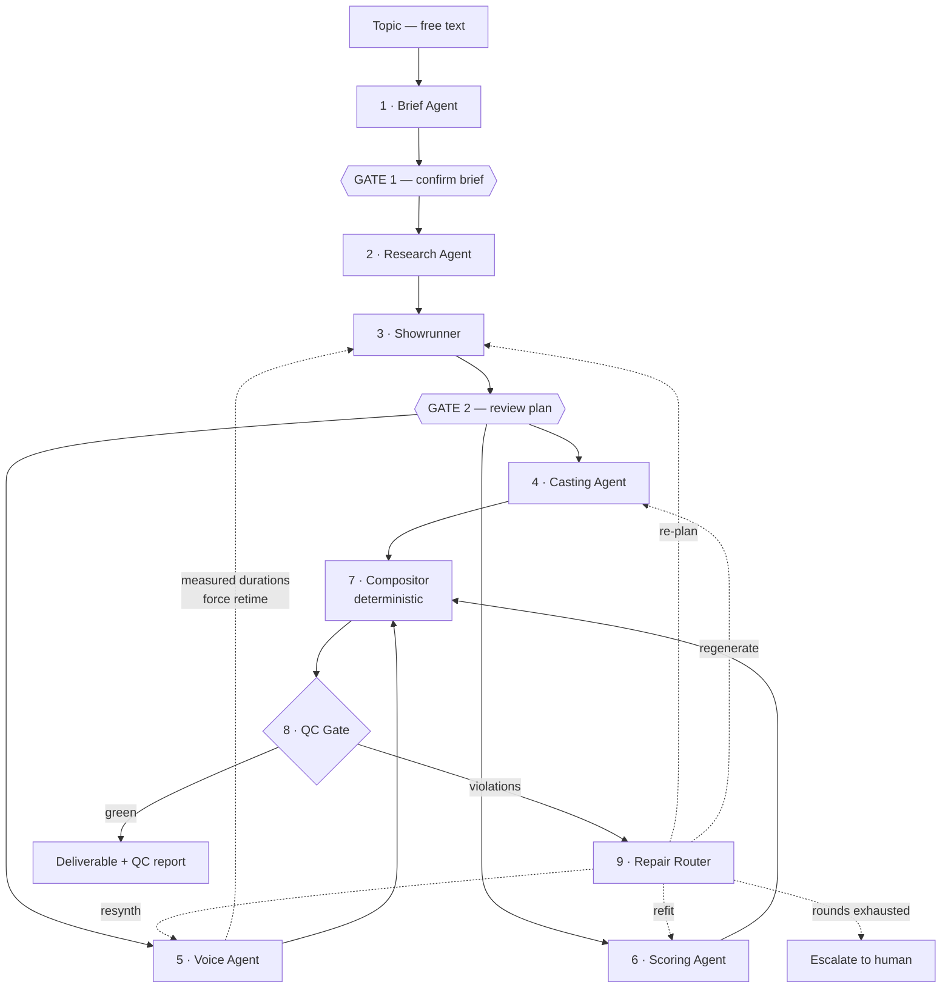
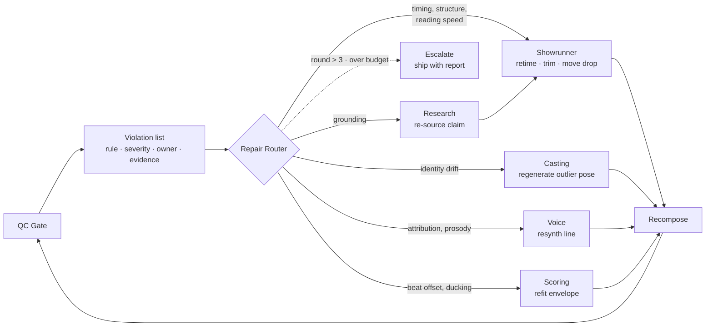
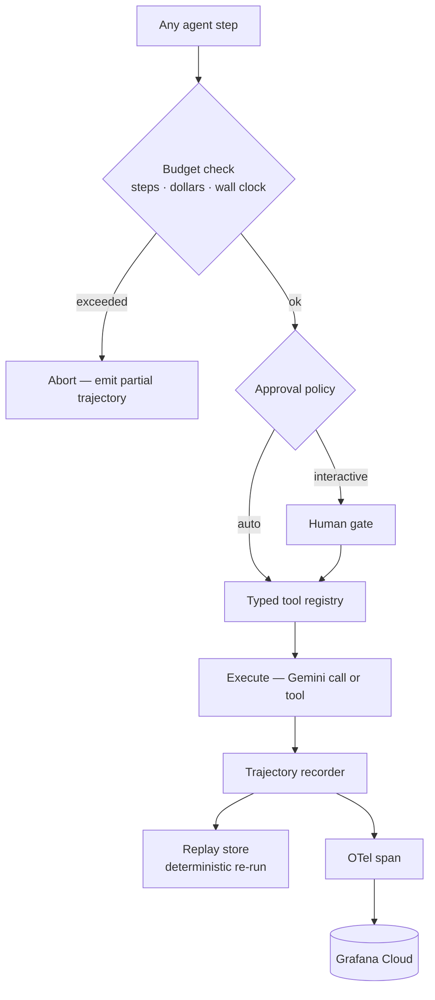
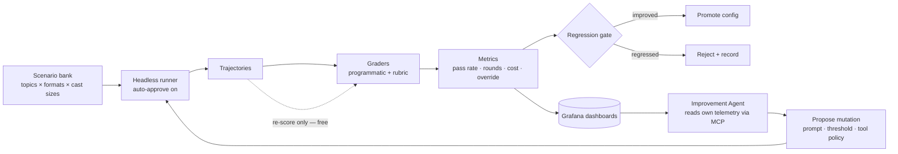

# Architecture

> A harness that ships spec-compliant short-form video.
> Six agents, two human gates, one deterministic compositor, and a QC loop that decides when the thing is done.
> The generated video is the output. **The pass rate is the product.**

| | |
|---|---|
| **Stack** | Gemini + Google Cloud Agent Builder (ADK) |
| **Partner track** | Grafana Cloud MCP |
| **Deadline** | September 7, 2026 |

---

## How to read this

The four diagrams below are **one system drawn four ways** — like architectural drawings of a single building: floor plan, wiring, plumbing, site plan. Same building every time.

There are seven agents in total: six make a video, one improves the other six.

| Diagram | What it shows | Zoom level | New agents |
|---|---|---|---|
| **Fig. 1** — Pipeline | One request, start to finish | The whole building | All six |
| **Fig. 2** — Repair loop | What happens when quality checks fail | Into stages 8–9 of Fig. 1 | None |
| **Fig. 3** — Harness | The plumbing under every agent step | Into *any single box* of Fig. 1 | None — no agents at all |
| **Fig. 4** — Eval loop | Running Fig. 1 unattended, hundreds of times | Back — whole system as one box | One |

### The crew, in plain terms

| Agent | What it actually does |
|---|---|
| **Brief** | The producer taking the order. You type "Voynich manuscript"; it decides 35 seconds, two-person debate, wry, flat-vector. Turns a vague topic into a spec sheet. |
| **Research** | The fact-checker. Searches, writes down true things with source links, so the script isn't invented. |
| **Showrunner** | Writer and director — the most important one. Writes the dialogue, assigns every line to a character, structures the arc, and decides where each cut lands. |
| **Casting** | The character designer. Draws each character once in several poses, and keeps Person 1 looking like Person 1 in every shot. |
| **Voice** | The voice director. Routes each line to its character's voice and measures how long the line *actually* takes. |
| **Scoring** | The composer. Builds the track, finds the beat, places the drop where the Showrunner asked, ducks under speech. |
| **Improvement** | Makes no videos. Reads how the other six performed across hundreds of runs and proposes changes. Appears only in Fig. 4. |

**The one-line version:** Fig. 1 is the product. Fig. 3 is the engine. Fig. 2 is what makes the product reliable. Fig. 4 is what proves it.

---

## Four load-bearing decisions

Everything downstream follows from these. If one changes, the architecture changes.

### The EDL is the artifact, not the video

Agents produce an edit decision list — shots with in/out points, VO segments with timing, a music track with a marked drop, caption spans, an intensity envelope. The video is a deterministic render of that document.

This makes evaluation cheap (most checks run on the plan, no pixels generated), makes the agent's reasoning diffable, and makes re-targeting to another platform a re-render rather than a re-generation.

### Characters are assets, not generations

Each character is generated once as a sprite set, content-hashed and cached, then animated programmatically. Identity consistency becomes structural instead of probabilistic — and the cost of a re-render drops to zero, which is what makes hundreds of eval runs affordable.

### Gates sit where changes are cheap and consequences are expensive

Two hard gates: after the brief, and after the plan. Both operate on text. Everything downstream of the second gate runs autonomously under automatic QC. Per-shot approval is deliberately absent — it is too granular to be useful and it destroys the ability to run unattended.

### Every gate has an auto-approve path

A system that requires a human cannot be evaluated, and the evaluation harness is the reason this project is worth building. The same code runs interactive for the product and headless for the eval sweep. The delta between the two — how often a human overrides auto-approve — becomes a first-class metric.

---

## Fig. 1 — The pipeline

One request, end to end. Solid edges are the forward path; dashed edges are feedback. The only cycle in the system is the QC repair loop — everything else is a straight line, which is what keeps it debuggable.



> **The edge people forget.** Synthesized speech is never the length you estimated. The Voice Agent measures actual segment durations and pushes them back to the Showrunner, which retimes the EDL before compositing. Without that edge, every cut drifts off the beat grid and your alignment check fails on every run — for a reason that has nothing to do with planning quality.

---

## Agent responsibilities

Six agents, and each one earns its place by owning a decision the others cannot make. Loop depth is the honest measure of whether something needs to be an agent at all.

| Stage | Owns | Key tools | Loop | Repairable |
|---|---|---|---|---|
| **1 · Brief** | Format, cast size, duration, tone, visual direction | `format_catalog`, `topic_probe`, `duration_policy` | Shallow | No — gated |
| **2 · Research** | Claim ledger with per-claim sourcing | `search`, `fetch`, `claim_extract`, `contradiction_check` | Deep | Yes |
| **3 · Showrunner** | Dialogue graph, arc, drop placement, shot boundaries | `format_validator`, `beat_grid`, `duration_estimate`, `shot_budget` | Deep | Yes — primary |
| **4 · Casting** | Sprite sets, identity coherence, asset cache | `imagen_generate`, `identity_distance`, `cache_lookup` | Medium | Yes |
| **5 · Voice** | Speaker routing, prosody, measured timing | `tts_synthesize`, `measure_duration`, `loudness_normalize` | Shallow | Yes |
| **6 · Scoring** | Track selection, beat grid, drop position, ducking curve | `music_generate`, `beat_detect`, `envelope_fit` | Shallow | Yes |

---

## Fig. 2 — The repair loop

This is the part that distinguishes the project from a generation pipeline. A violation is not a failure — it is a typed message routed to whichever agent owns the rule, with the evidence attached. The router is deterministic; the repair is not.



Bound it at three rounds. An unbounded repair loop is how you wake up to a $40 overnight bill and a trajectory 400 steps long. When rounds are exhausted, ship the artifact *with* its violation report rather than failing — partial output plus an honest account of what's wrong is more useful than nothing, and it makes the failure legible.

---

## QC rule set

The economics of this table are the economics of the project. Nine of the eleven rules are pure computation, which is what makes a 100-run eval sweep cost cents instead of dollars.

| Rule | Check | Cost | Owner |
|---|---|---|---|
| Beat alignment | Cut offset from detected beat grid, in ms | Free | Showrunner |
| Duration adherence | Total runtime within target ± 1s | Free | Showrunner |
| Reading speed | Caption chars/sec against subtitle standards | Free | Showrunner |
| Pacing curve | Shot-length distribution vs. intensity envelope | Free | Showrunner |
| Speaker attribution | Each line rendered in its character's voice | Free | Voice |
| Screen-time balance | Per-character share vs. configured split | Free | Showrunner |
| Identity drift | Perceptual distance from canonical reference | Free | Casting |
| Music ducking | Energy delta in dB across VO spans | Free | Scoring |
| Loudness spec | Integrated loudness at −14 LUFS | Free | Scoring |
| Grounding | Script claims traceable to the claim ledger | Flash | Research |
| Coherence | Rubric score on arc, hook, and turn quality | Flash | Showrunner |

Split the set by stage. Rules that read only the EDL run before any asset is generated — that is your cheap gate, and it catches most planning failures for free. Rules that need rendered audio or pixels run after compositing, on far fewer runs.

---

## Contracts between stages

Fix these four shapes early. Retrofitting multi-speaker support into a single-narrator schema is the expensive mistake — design for *n* characters on day one even while you implement *n* = 1.

**Brief** — output of stage 1

```yaml
format: two_host_debate
duration_s: 35
cast:
  - id: skeptic
    voice:    { id, pace, pitch, style }
    identity: { refs[], descriptor, seed }
    persona:  { role, verbosity, tics }
  - id: enthusiast
    # …
tone: wry
visual: flat_vector · muted
music_intent: { curve, drop_at_s }
assumptions: [ ]   # editable chips
```

**Dialogue line** — output of stage 3

```yaml
idx: 4
speaker: skeptic
text: "…"
delivery: { emotion, emphasis[] }
claim_refs: [ c_07, c_12 ]
t_est_s: 3.4       # pre-synthesis
t_actual_s: 3.9    # measured back
shot: sh_04
```

**EDL shot**

```yaml
id: sh_04
in_s: 12.30
out_s: 16.20
on_beat: true
beat_offset_ms: 18
layers:
  - { type: character, id: skeptic, pose: talking, x, y, scale }
  - { type: bg, asset: bg_02 }
  - { type: caption, span: [12.4, 16.0] }
intensity: 0.72
```

**Violation** — output of stage 8

```yaml
rule_id: beat_alignment
severity: warn        # warn | fail
owner: showrunner
evidence:
  shot: sh_04
  offset_ms: 142
  threshold_ms: 60
suggested_action: retime
round: 1
```

---

## Fig. 3 — The harness cross-section

Every agent step in Fig. 1 passes through this path. It is the same code for all six agents, and it is the part of the repository worth keeping — a package with no video-domain imports that happens to be driving a video pipeline today.



Two details worth building properly. **The budget check runs first** — checking after execution means you have already spent the money. And **the trajectory recorder captures both the model call and the tool result**, which is what makes replay possible: when only your grading logic changes, you re-score recorded runs at zero cost instead of re-running the agent.

---

## Fig. 4 — Evaluation and self-improvement

The offline loop. This runs entirely headless with auto-approve enabled, which is only possible because of the fourth load-bearing decision above.



The Improvement Agent is constrained on purpose. It mutates a fixed search space — prompt variants, QC thresholds, repair-routing policy, shot-budget heuristics — and never writes arbitrary code. Open-ended self-modification will not be demo-reliable in a month, and the constrained version produces a cleaner result anyway: every mutation is attributable to a metric change.

### Metrics worth putting on the dashboard

| Metric | Why it earns a panel |
|---|---|
| QC pass rate, by format | Expect it to fall as cast size rises. That curve is the most interesting finding in the project. |
| Repair rounds to green | Measures planning quality directly — a better Showrunner needs fewer rounds. |
| Cost per finished reel | Should fall over the month. Doubles as your budget instrument. |
| Override rate at each gate | How often a human rejects what auto-approve accepted. Points at the weakest judgment in the system. |
| Violation frequency by rule | Tells the Improvement Agent where to aim. |
| Cache hit rate on casts | The single largest lever on cost. |

---

## Deliberately not agents

Three components that look like they want to be agents and must not be. Restraint here is what keeps the system debuggable.

| Component | Kind | Reason |
|---|---|---|
| **Compositor** | Deterministic | Same EDL must produce the same bytes. Any nondeterminism here makes every QC result unreproducible and replay meaningless. |
| **QC Gate** | Validator | A judge you cannot trust to be stable is not a judge. Nine of eleven rules are arithmetic; the two model-graded ones are pinned and versioned. |
| **Repair Router** | Lookup | Rule-to-owner is a fixed map. Making it a model call adds a failure mode to your error-recovery path, which is the last place you want one. |

---

## Build order

Vertical slice first. The single riskiest path — a Gemini call reaching Grafana through the MCP server — gets proven before any architecture is written, because everything on this page is moot if it fails.

| Dates | Milestone |
|---|---|
| **Aug 4–6** | **Spike, then commit.** Gemini via ADK calls the Grafana Cloud MCP server and reads one metric. Confirm Veo and Lyria quota and price one render. If Veo is out of reach, the sprite path becomes plan A rather than the fallback. |
| **Aug 7–13** | **Harness core plus a one-shot spine.** Tool registry, trajectory recorder, budget enforcer. Brief → Showrunner → Compositor with a single narrator and no research. It will look bad. It runs end to end. |
| **Aug 14–20** | **QC gate and the repair loop.** All nine free rules, the violation schema, the router. This is the week the project becomes what it is. Add Research and Casting once repair closes. |
| **Aug 21–27** | **Second speaker and the eval harness.** Cast of two, attribution and identity rules live. Scenario bank, headless runner, first real pass-rate number on a Grafana panel. |
| **Aug 28–Sep 3** | **Improvement loop and hosting.** One measured improvement, start to finish, with a before-and-after curve. Deploy. Freeze features on Sep 3 regardless of what is unfinished. |
| **Sep 4–5** | **Video, README, writeup — submit.** Three formats on one topic, side by side. Lead the README with the eval curve, not the sample output. Submit Sep 5; the deadline is 2:00pm PDT Sep 7 and you do not want to meet it. |
