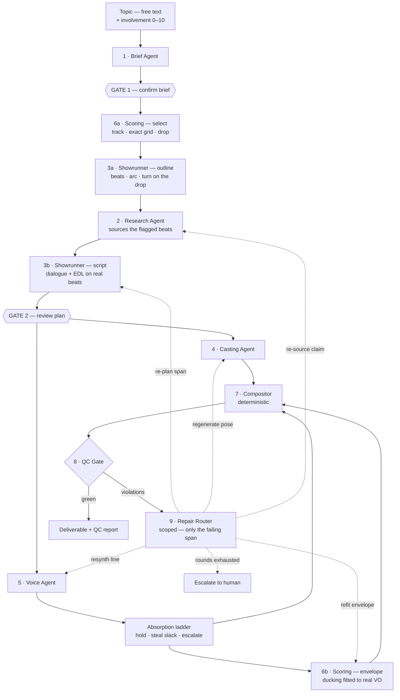
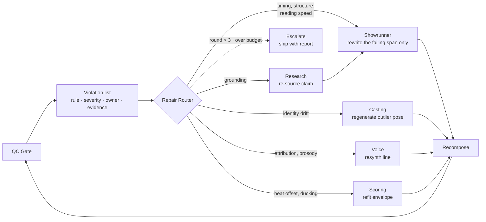
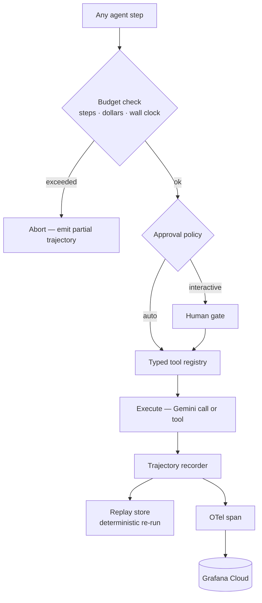
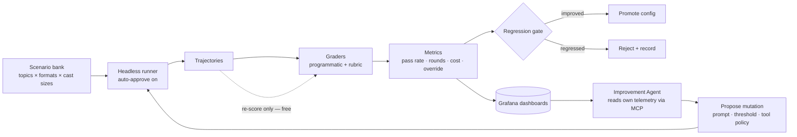

# Architecture

> A harness that ships spec-compliant short-form video.
> Six agents, two dial-governed gates, one deterministic compositor, and a QC loop that decides when the thing is done.
> The generated video is the output. **The pass rate is the product.**

| | |
|---|---|
| **Stack** | Gemini + Google Cloud Agent Builder (ADK) |
| **Partner track** | Grafana Cloud MCP |
| **Deadline** | September 7, 2026 |

> **This document says *that* the agents exist and how they fit together.**
> [AGENTS.md](AGENTS.md) says what each one *is* — contracts, triggers, locked decisions, and what's still open. When the two disagree, AGENTS.md is newer.

---

## How to read this

The four diagrams below are **one system drawn four ways** — like architectural drawings of a single building: floor plan, wiring, plumbing, site plan. Same building every time.

There are seven agents in total: six make a video, one improves the other six.

| Diagram | What it shows | Zoom level | New agents |
|---|---|---|---|
| **Fig. 1** — Pipeline | One request, start to finish | The whole building | All six |
| **Fig. 2** — Repair loop | What happens when quality checks fail | Into stages 8–9 of Fig. 1 | None |
| **Fig. 3** — Harness | The plumbing under every agent step | Into *any single box* of Fig. 1 | None — no agents at all |
| **Fig. 4** — Eval loop | Running Fig. 1 unattended, hundreds of times | Back — whole system as one box | One |

### The crew, in plain terms

| Agent | What it actually does |
|---|---|
| **Brief** | The producer taking the order. You type "Voynich manuscript"; it decides 35 seconds, two-person debate, wry, flat-vector. Turns a vague topic into a spec sheet. |
| **Research** | The fact-checker. Sources exactly the beats the Showrunner's outline flagged as needing a fact — not the topic broadly — so nothing is researched and discarded. |
| **Showrunner** | Writer and director — the most important one. Runs **twice**: an outline pass that structures the arc and flags what needs facts, then a script pass that writes dialogue and cuts against a real beat grid. |
| **Casting** | The character designer. Draws each character once in several poses, and keeps Person 1 looking like Person 1 in every shot. Renders the backgrounds the script describes. |
| **Voice** | The voice director. Routes each line to its character's voice and measures how long the line *actually* takes. Deterministic on the hot path — it only thinks when something goes wrong. |
| **Scoring** | The music supervisor. Also runs **twice**: picks the track and hands over an exact beat grid before anything is planned, then fits a ducking envelope once the voice exists. |
| **Improvement** | Makes no videos. Reads how the other six performed across hundreds of runs and proposes changes. Appears only in Fig. 4. |

**The one-line version:** Fig. 1 is the product. Fig. 3 is the engine. Fig. 2 is what makes the product reliable. Fig. 4 is what proves it.

---

## Four load-bearing decisions

Everything downstream follows from these. If one changes, the architecture changes.

### The EDL is the artifact, not the video

Agents produce an edit decision list — shots with in/out points, VO segments with timing, a music track with a marked drop, caption spans, an intensity envelope. The video is a deterministic render of that document.

This makes evaluation cheap (most checks run on the plan, no pixels generated), makes the agent's reasoning diffable, and makes re-targeting to another platform a re-render rather than a re-generation.

### Characters are assets, not generations

Each character is generated once as a sprite set — five poses plus a mouth-open variant — content-hashed, cached, and then animated by arithmetic: a 5Hz talk cycle gated by audio amplitude, a sine bob at idle, scale pulses on emphasis, hard cuts on beats. Identity consistency becomes structural instead of probabilistic.

**The cost consequence is the one that matters at a $100 ceiling: output frame rate is free.** Frames are composited by ffmpeg on CPU, so 24, 30, and 60fps cost exactly the same. Nothing is generated per frame, per second, or per shot. The only thing that costs money is a *distinct drawing*, and there are six of them per character, generated once and reused across every reel that casts the same archetype.

**Renders run at 30fps**, chosen on how it divides rather than on cost: a 3-frame mouth hold lands the talk cycle at 5Hz, inside the natural syllable band, and divides evenly so the alternation never judders. The frame rate is pinned in config and recorded per run, because it changes the output bytes and *same EDL → same bytes* has to keep meaning something.

> **Frame duration is a floor on beat-alignment precision.** Cuts quantize to frame boundaries, so at 30fps a cut can sit ±16.7ms off its beat no matter how good the planner is. That is a quarter of the 60ms threshold — fine. Tighten the threshold below ~35ms and the frame rate becomes the limiting factor rather than the Showrunner, at which point the rule measures the encoder. 60fps halves the error if that headroom is ever needed, and costs only ffmpeg time.

Sprites are keyed on `(archetype, style, pose)` rather than on the topic, so "a skeptic in flat vector" is drawn once and reused everywhere. Cache hit rate on an eval sweep lands near 95%, which is what makes hundreds of runs affordable — and it is the single largest lever on cost per reel, so it belongs on the dashboard from day one.

**Backgrounds come from a library by default**, not from generation. Per-shot generated backgrounds are near-unique by construction and therefore barely cache; they would have become the most expensive stage in the pipeline immediately after characters were optimised to nearly zero. Generation stays available behind a `--bespoke-bg` flag for the handful of reels a human actually watches.

### Gates sit where changes are cheap and consequences are expensive

Two hard gates: after the brief, and after the plan. Both operate on text. Everything downstream of the second gate runs autonomously under automatic QC. Per-shot approval is deliberately absent — it is too granular to be useful and it destroys the ability to run unattended.

> **One knowing exception.** Music selection now runs *before* Gate 2, because the Showrunner needs a real beat grid to cut against. Gate 2 is therefore no longer strictly upstream of all asset spend. Acceptable because the track comes from a pre-scored library — the selection is a lookup, not a generation — but it is a deliberate softening of this principle rather than an oversight.

### Every gate has an auto-approve path — and one dial controls them all

A system that requires a human cannot be evaluated, and the evaluation harness is the reason this project is worth building.

The mechanism is a single run-level integer, **`involvement: 0–10`**, that resolves to a question budget and a confidence threshold. The agent scores its own confidence per field and asks about the least-confident ones until the budget runs out; everything unasked is decided and shown as an editable assumption chip.

| Dial | Questions | Asks below confidence | Feels like |
|---|---|---|---|
| **0** | 0 | — | Vending machine — topic in, video out |
| **5** | 2 per gate | 0.60 | Asks about the one or two real forks |
| **10** | 6 per gate | 0.99 | Collaborator — confirms nearly everything |

**`involvement: 0` is not a headless mode. It is the same agent, asking zero questions.** The eval sweep runs at 0 and the product ships at 5, with no second code path to drift out of sync. The delta between them — how often a human overrides what auto-approve accepted — becomes a first-class metric, and plotting override rate *against* the dial points straight at the weakest judgment in the system.

---

## Fig. 1 — The pipeline

One request, end to end. Solid edges are the forward path; dashed edges are feedback. The only cycle in the system is the QC repair loop — everything else is a straight line, which is what keeps it debuggable.



**Three orderings here are load-bearing, and each was chosen against an obvious-looking alternative.**

> **Scoring runs first, before anything is planned.** The Showrunner cuts to a beat grid, and that grid has to be real. Because tracks come from a pre-scored library, their grids and drop positions are measured exactly, offline — so beat alignment is checked against ground truth. Every `beat_alignment` failure is then a genuine planning failure, never beat-detection error. Scoring also *proposes* the drop from the track's own structure, and the outline places its emotional turn there: the story lands on a real musical event instead of an arbitrary timestamp.

> **Research sits between the Showrunner's two passes.** You cannot know which facts you need until you know what the script is about. The outline flags beats as `needs_fact`; Research sources exactly those. Researching the topic broadly first spends money on claims the script never uses, and quietly lets whatever the search surfaced dictate the story.

> **The edge people forget — and it is not an agent edge.** Synthesized speech is never the length you estimated. But the correction is arithmetic, not judgment: real durations replace estimates, an underrun holds the last frame, an overrun steals slack from neighbouring pauses, and cuts snap to the nearest real beat. Only when the drift exceeds `max_hold_s` does a model get called — and then it rewrites *that line only*. Without this the cuts drift off the grid and alignment fails on every run, for a reason that has nothing to do with planning quality.

---

## Agent responsibilities

Six agents, and each one earns its place by owning a decision the others cannot make. Loop depth is the honest measure of whether something needs to be an agent at all.

| Stage | Owns | Key tools | Loop | Repairable |
|---|---|---|---|---|
| **1 · Brief** | Format + params, cast, voices, duration, tone, visual direction | `format_catalog`, `topic_probe`, `duration_policy` | Shallow | No — gated |
| **6a · Scoring** | Track selection, exact beat grid, proposed drop | `track_select` | None — a lookup | Yes — reselect |
| **3a · Showrunner** | Beats, arc, turn placement, `needs_fact` flags | `format_validator`, `beat_grid`, `shot_budget` | Shallow | Yes |
| **2 · Research** | Claim ledger with per-claim sourcing | Gemini grounded search, `contradiction_check` | Deep | Yes |
| **3b · Showrunner** | Dialogue, shot boundaries, cut points, background descriptions | `format_validator`, `beat_grid`, `duration_estimate`, `shot_budget` | Deep | Yes — primary |
| **4 · Casting** | Sprite sets, backgrounds, identity coherence, asset cache | `imagen_generate`, `identity_distance`, `cache_lookup` | Medium | Yes |
| **5 · Voice** | Speaker routing, prosody, measured timing | `tts_synthesize`, `measure_duration`, `loudness_normalize` | **None on the hot path** | Yes |
| **6b · Scoring** | Ducking envelope, loudness | `envelope_fit`, `loudness_measure` | Shallow | Yes |

Two agents run twice rather than being split into four. The Showrunner's outline and script passes share a prompt and a metric — splitting them would double the surface the Improvement Agent has to search for half the attribution benefit. Scoring's two passes are forced apart by ordering, not by skill: the grid is needed before planning, and the ducking envelope cannot exist until the VO spans do.

**Every repair is scoped.** A violation on line 4 rewrites line 4 — not the script. Casting regenerates the outlier pose, not the sprite set; Research re-sources the claim, not the ledger. This keeps repairs cheap, prevents collateral drift into parts that already passed, and — most importantly — means round 2 can never undo round 1, which is the failure mode that makes repair loops thrash.

---

## Fig. 2 — The repair loop

This is the part that distinguishes the project from a generation pipeline. A violation is not a failure — it is a typed message routed to whichever agent owns the rule, with the evidence attached. The router is deterministic; the repair is not.



Bound it at three rounds. An unbounded repair loop is how you wake up to a $40 overnight bill and a trajectory 400 steps long. When rounds are exhausted, ship the artifact *with* its violation report rather than failing — partial output plus an honest account of what's wrong is more useful than nothing, and it makes the failure legible.

---

## QC rule set

The economics of this table are the economics of the project. Nine of the eleven rules are pure computation, which is what makes a 100-run eval sweep cost cents instead of dollars.

| Rule | Check | Threshold from | Cost | Owner |
|---|---|---|---|---|
| Beat alignment | Cut offset from the track's **exact** beat grid, in ms | `brief.params` | Free | Showrunner |
| Duration adherence | Total runtime within target ± tolerance | `brief.params` | Free | Showrunner |
| Reading speed | Caption chars/sec against subtitle standards | `brief.params` | Free | Showrunner |
| Pacing curve | Shot-length distribution vs. intensity envelope | `brief.params` | Free | Showrunner |
| Speaker attribution | Each line rendered in its character's voice | fixed | Free | Voice |
| Screen-time balance | Per-character share vs. configured split | `brief.params` | Free | Showrunner |
| Identity drift | Perceptual distance from canonical reference | `brief.params` | Free | Casting |
| Music ducking | Rendered dB deltas match Scoring's declared envelope | fixed | Free | Scoring |
| Loudness spec | Integrated loudness at −14 LUFS | fixed | Free | Scoring |
| Grounding | Checkable claims traceable to the claim ledger | 🔒 pinned | Flash | Research |
| Coherence | Rubric score on arc, hook, and turn quality | 🔒 pinned | Flash | Showrunner |

**Thresholds come from the brief, not from constants.** Because Brief tunes format parameters per topic — narrowing a debate's turn length from the catalog's 4–12s to 3–9s, say — the rules must read `brief.params` rather than hardcoding numbers. Write them that way from the first rule; retrofitting parameterized thresholds into hardcoded ones is the same expensive mistake as retrofitting multi-speaker support.

**The two model-graded rules are pinned and never mutable.** 🔒 See [Fig. 4](#fig-4--evaluation-and-self-improvement) — if the Improvement Agent can reach a grader, the cheapest way to raise the pass rate is to make the judge lenient.

Split the set by stage. Rules that read only the EDL run before any asset is generated — that is your cheap gate, and it catches most planning failures for free. Rules that need rendered audio or pixels run after compositing, on far fewer runs.

---

## Contracts between stages

Fix these four shapes early. Retrofitting multi-speaker support into a single-narrator schema is the expensive mistake — design for *n* characters on day one even while you implement *n* = 1.

**Brief** — output of stage 1

```yaml
format: two_host_debate      # from the closed catalog
params:                      # tuned within the catalog's legal range
  cast_size:     2
  turn_len_s:    [3, 9]      # catalog allows [4, 12]
  hook_budget_s: 2.5
  max_hold_s:    2.0         # QC reads its thresholds from here
duration_s: 35
cast:
  - id: skeptic
    voice:    { id, pace, pitch, style }   # assigned here, at cast time
    identity: { refs[], descriptor, seed, distinct: false }
    persona:  { role, verbosity, tics }
  - id: enthusiast
    # …
tone: wry
visual: flat_vector · muted
music_intent: { mood, drop_at_s }   # drop_at_s is a selection HINT, not a constraint
confidence: { format: 0.85, tone: 0.45, … }   # drives the involvement dial
assumptions: [ ]   # editable chips
brief_invalid: false   # schema check runs, records, never blocks
```

**Dialogue line** — output of stage 3

```yaml
idx: 4
speaker: skeptic
text: "…"
delivery: { emotion, emphasis[] }
claim_refs: [ c_07, c_12 ]
t_est_s: 3.4       # pre-synthesis
t_actual_s: 3.9    # measured back
shot: sh_04
```

**EDL shot**

```yaml
id: sh_04
in_s: 12.30
out_s: 16.20
on_beat: true
beat_offset_ms: 18
layers:
  - { type: character, id: skeptic, pose: talking, x, y, scale }
  - { type: bg, desc: "dim library, manuscript on table" }   # rendered by Casting
  - { type: caption, span: [12.4, 16.0] }
intensity: 0.72
hold_s: 0.4        # absorbed drift — freeze on the last frame
```

Poses come from a fixed core set — `talking · listening · reacting · gesturing · idle` — plus at most two Showrunner-requested extras per reel. The fixed core is what lets the EDL be validated against an enum *before any pixel is generated*.

**Violation** — output of stage 8

```yaml
rule_id: beat_alignment
severity: warn        # warn | fail
owner: showrunner
evidence:
  shot: sh_04
  offset_ms: 142
  threshold_ms: 60
suggested_action: retime
round: 1
```

---

## Fig. 3 — The harness cross-section

Every agent step in Fig. 1 passes through this path. It is the same code for all six agents, and it is the part of the repository worth keeping — a package with no video-domain imports that happens to be driving a video pipeline today.



Two details worth building properly. **The budget check runs first** — checking after execution means you have already spent the money. And **the trajectory recorder captures both the model call and the tool result**, which is what makes replay possible: when only your grading logic changes, you re-score recorded runs at zero cost instead of re-running the agent. With grounded search in the pipeline that recorder must persist the returned text and citation metadata verbatim, not just the query — retrieval will not reproduce next week, but re-scoring against stored evidence stays free.

### Budget caps are per stage, and breach behaviour is not uniform

Total project credit is **$100**, which makes this the enforcement point for the whole system rather than a safety net. Every stage carries a hard dollar cap checked before execution, and the run carries a hard total of **`$0.110`** — sized so that a 100-scenario sweep costs about $11 and the improvement loop gets enough sweeps to prove something.

| | |
|---|---|
| **Abort** on breach | Brief · Showrunner outline · **QC graders** |
| **Degrade** on breach | Research · Showrunner script · Casting · Voice · Scoring envelope |
| **Escalate** on breach | Repair pool — ship with the violation report |

Cheap early stages abort because restarting costs nothing; expensive late stages degrade, emitting what they have so the run isn't thrown away after most of its money is spent. **QC is the exception that proves it: it never degrades.** Running out of budget at the gate voids the run rather than producing a softer verdict, because a partial judge is worse than no judge when the pass rate is the product.

Full per-stage table, with rationale: [AGENTS.md § Cost model](AGENTS.md#-cost-model--the-100-constraint).

---

## Fig. 4 — Evaluation and self-improvement

The offline loop. This runs entirely headless with auto-approve enabled, which is only possible because of the fourth load-bearing decision above.



The Improvement Agent is constrained on purpose. It mutates a fixed search space — **prompt variants, QC thresholds, brief parameter defaults, shot-budget heuristics** — and never writes arbitrary code. Pipeline topology, the tool registry, and the repair-routing policy are frozen: mutating your error-recovery path means a regression can break the very thing that fixes regressions. Open-ended self-modification will not be demo-reliable in a month, and the constrained version produces a cleaner result anyway.

**One mutation per sweep, aimed at the highest-frequency violation.** The agent doesn't get free choice of target — it must attack whichever rule fails most often, which forces a defensible reason for every proposal and keeps each A/B attributable to exactly one cause. That's what lets the writeup claim *this change caused this gain* rather than *things got better*, which for a project whose product is the pass rate is the entire argument.

It reads Grafana aggregates through MCP, plus the trajectories of exactly two runs — the best and the worst on the target metric. Aggregates say where it hurts; the exemplar pair says why, at a bounded context cost.

Promotion is automatic inside guardrails: `pass_rate` improved **and** `cost_per_reel` did not rise **and** no single rule regressed by more than 2%. Anything outside those bounds becomes a proposal for a human instead.

### 🔒 It cannot touch what grades it

**The Improvement Agent has no write path to grader prompts or grader thresholds.** `grounding` and `coherence` are model-graded, and if either is reachable from the mutation space, the cheapest available way to raise the pass rate is to make the judge lenient — the agent will find that long before it finds a better Showrunner.

This is the standard failure mode of any system optimizing against its own evaluator, so enforce it structurally rather than by instruction: graders live in a separate versioned namespace that `propose_mutation` cannot address, pinned for the project's lifetime, with the version recorded on every run. A pass-rate curve is only meaningful if it means the same thing at both ends.

### Metrics worth putting on the dashboard

| Metric | Why it earns a panel |
|---|---|
| QC pass rate, by format | Expect it to fall as cast size rises. That curve is the most interesting finding in the project. |
| Repair rounds to green | Measures planning quality directly — a better Showrunner needs fewer rounds. |
| Cost per finished reel | Should fall over the month. Doubles as your budget instrument. |
| Override rate at each gate | How often a human rejects what auto-approve accepted. Points at the weakest judgment in the system. |
| Violation frequency by rule | Tells the Improvement Agent where to aim. |
| Cache hit rate on casts | The single largest lever on cost. |

---

## Deliberately not agents

Three components that look like they want to be agents and must not be. Restraint here is what keeps the system debuggable.

| Component | Kind | Reason |
|---|---|---|
| **Compositor** | Deterministic | Same EDL must produce the same bytes. Any nondeterminism here makes every QC result unreproducible and replay meaningless. |
| **QC Gate** | Validator | A judge you cannot trust to be stable is not a judge. Nine of eleven rules are arithmetic; the two model-graded ones are pinned and versioned. |
| **Repair Router** | Lookup | Rule-to-owner is a fixed map. Making it a model call adds a failure mode to your error-recovery path, which is the last place you want one. |
| **Absorption ladder** | Arithmetic | Retiming to measured audio is subtraction, not judgment. Holding a frame, stealing slack from a neighbouring pause, snapping to a beat — all deterministic. A model is called only when the drift exceeds `max_hold_s`. |
| **Voice, on the hot path** | Function | Voice ids are assigned by Brief; delivery comes from the script. Synthesis and measurement are pure calls. The agent exists but is invoked only on escalation and repair. |
| **Track selection** | Lookup | The library is pre-scored, so picking by mood and duration is a query. Its grids and drop positions are measured once, offline, exactly. |

---

## Build order

Vertical slice first. The single riskiest path — a Gemini call reaching Grafana through the MCP server — gets proven before any architecture is written, because everything on this page is moot if it fails.

| Dates | Milestone |
|---|---|
| **Aug 4–6** | **Spike, then commit.** Gemini via ADK calls the Grafana Cloud MCP server and reads one metric. Confirm Imagen and TTS quota and price one render. Assemble the pre-scored music library and measure its beat grids offline — that artifact is a prerequisite for every planning stage downstream. |
| **Aug 7–13** | **Harness core plus a one-shot spine.** Tool registry, trajectory recorder, budget enforcer. Brief → Showrunner → Compositor with a single narrator and no research. It will look bad. It runs end to end. |
| **Aug 14–20** | **QC gate and the repair loop.** All nine free rules, the violation schema, the router. This is the week the project becomes what it is. Add Research and Casting once repair closes. |
| **Aug 21–27** | **Second speaker and the eval harness.** Cast of two, attribution and identity rules live. Scenario bank, headless runner, first real pass-rate number on a Grafana panel. |
| **Aug 28–Sep 3** | **Improvement loop and hosting.** One measured improvement, start to finish, with a before-and-after curve. Deploy. Freeze features on Sep 3 regardless of what is unfinished. |
| **Sep 4–5** | **Video, README, writeup — submit.** Three formats on one topic, side by side. Lead the README with the eval curve, not the sample output. Submit Sep 5; the deadline is 2:00pm PDT Sep 7 and you do not want to meet it. |
