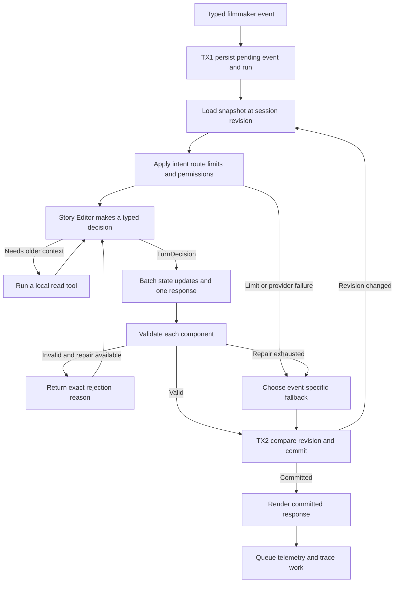

# Codex Agentic Film Harness

**Working product vision**  
**Updated:** 2026-09-01

## 1. The idea

Second Unit is an agentic production harness that stays with a filmmaker from
the first story idea through a production-ready short film.

It is not only a chatbot and it is not a one-click film generator. It is a
persistent workspace that remembers the film, understands the current stage,
keeps creative and production decisions connected, and helps the filmmaker
decide what to do next.

The product flow is:

```text
Interview
→ Outline
→ Screenplay
→ Scene breakdown
→ Shooting schedule
→ Shot list
→ Production readiness
→ Continuous deadline and shoot follow-through
```

The central promise is:

> Second Unit remembers the entire film, understands what every change affects,
> and keeps the production moving from the first idea toward the shoot.

## 2. Product principles

### 2.1 The filmmaker remains the authority

AI suggestions are not decisions. Generated work is not automatically approved.
The application must always distinguish:

```text
Suggested → Accepted → Approved → Scheduled → Completed
```

### 2.2 Assistance should reduce blank-page work

The filmmaker should not be forced to invent every answer from nothing. When a
meaningful creative fork exists, the assistant can present two or three concrete
possibilities as selectable cards. The user may choose one, combine several,
reject them, or add a note.

### 2.3 Approved artifacts are protected

Approved outlines, screenplays, schedules, and shot lists are never silently
rewritten. A change creates a new working state and requires review again.

### 2.4 Changes must propagate

If Scene 8 changes from a night exterior to a day interior, the system should
recognize that the breakdown, schedule, equipment plan, shot list, and readiness
report may now be stale.

### 2.5 Deterministic rules beat AI judgment where possible

Deadline calculations, task status, dependency checks, page totals, and missing
legal or safety requirements should be calculated by code. AI should explain
the implications and propose remedies, not redefine the rules.

## 3. The Interview stage

The Interview is the first creative workspace. Its purpose is to help the
filmmaker discover and clarify the film without becoming either an interrogation
or an automatic story generator.

### 3.1 What a good Interview agent feels like

A good Story Editor can:

- ask one sharp, contextual question
- reflect what it thinks the writer means
- notice contradictions or unresolved decisions
- offer coaching when the writer is stuck
- provide two or three selectable suggestions when useful
- explain how each suggestion changes the film
- remember the complete conversation
- avoid repeating questions
- assess whether enough visible scene material exists
- recommend moving to an outline at the right time

It should not ask questions simply because character, conflict, theme, and
structure are common screenplay categories. It should follow the specific
material in front of it.

### 3.2 Storytelling format

Before the interview, the filmmaker chooses an initial storytelling preference:

- Narrated
- Dialogue-led
- Hybrid
- Not sure yet

This choice guides the interview but is not permanently locked. Once the outline
exists, the Screenplay stage can reassess which form actually serves the film.

### 3.3 Creative involvement

The involvement control changes how proactively the Story Editor helps:

| Mode | Interview behavior |
|---|---|
| AI-led | Proactively offers concrete directions and helps develop possibilities, while keeping unselected ideas outside story canon. |
| Collaborative | Balances focused questions, reflection, coaching, and selectable possibilities. |
| Author-led | Lets the writer make consequential choices while keeping help available whenever requested. |

The default should feel collaborative rather than restrictive. These modes
change initiative and drafting latitude; they never impose a maximum number of
answers.

### 3.4 Response types

The Story Editor can use five primary response intents:

1. **Question** — one focused question grounded in the latest answer
2. **Reflection** — a concise interpretation for the writer to confirm or reject
3. **Coaching** — guidance about why a choice matters
4. **Suggestions** — two or three selectable creative possibilities
5. **Outline recommendation** — evidence that the story can support an outline,
   with a choice to build it or keep developing

A visible reply may combine a short reflection or coaching block with
suggestions and at most one question. The primary intent determines which UI
controls appear:

| Primary intent | Required controls |
|---|---|
| Question | Composer and **Send** |
| Reflection | **Confirm**, **Correct**, and **Add nuance** |
| Coaching | Composer, **Continue**, and optional **Ask a follow-up** |
| Suggestions | Checkboxes, **Use selected**, and **None fit** |
| Outline recommendation | **Build outline** and **Keep developing** |

The composer says **Send**, not always **Answer and continue**, because the
filmmaker may answer, ask the editor something, correct a misunderstanding, or
give an instruction.

Suggestions should be structured UI objects rather than buried inside prose:

```text
Ideas to consider

☐ Keep the confrontation public
  Social pressure makes silence more costly.

☐ Move it somewhere private
  Isolation makes the same conflict more threatening.

☐ Delay the confrontation
  Suspense comes from what both characters avoid saying.

[Use selected ideas and continue]
```

Checking a suggestion does not change the story. Pressing **Use selected** sends
a structured selection event and makes the chosen idea accepted writer input.
Until then, it remains a proposal and must not appear in established story facts.

### 3.5 Interview memory

The Story workspace shows the complete conversation:

- starting idea
- assistant questions
- reflections and coaching
- suggestions shown
- suggestions selected
- writer answers
- skipped decisions
- established facts
- unresolved critical gaps
- readiness assessment and explanation

The conversation is stored as project state. It is not dependent on the visible
browser session or on an LLM remembering earlier calls.

Active, outline-ready, archived, and completed Interviews all appear in project
history and can be reopened from server-side state. Browser storage may remember
the last project as a convenience, but it is never the only way to recover an
active conversation. The timeline includes the current assistant response,
pending filmmaker events, and the status of every suggestion.

Voice is an input adapter, not a separate agent mode. Transcription remains
editable and is never submitted automatically. Typed text is preserved, audio
is not retained, and the UI exposes unavailable, permission, connecting,
listening, finishing, complete, and failed states. The microphone is enabled
only after a successful live speech-service handshake, and conflicting actions
remain disabled while audio is being captured.

### 3.6 Interview readiness

Readiness asks whether the current material can support an honest scene outline.
It considers:

- whose actions carry the film
- what creates pressure or change
- whether there is a visible sequence of events
- whether the ending or final image is sufficiently understood

It should not behave like a progress bar that only increases. A new answer can
reveal a genuine gap, but a large decrease requires a concrete explanation.
The primary UI shows the evidence that is ready and what still needs attention;
a percentage, if retained, is secondary.

When enough material exists, the assistant should say:

> You have enough for a first outline. You can review it now or continue
> developing the story.

This is clearer than exposing internal safety-limit language.

Interview status follows one state machine:

```text
Active → Ready for outline → Outline started
   ↑              |
   └──────────────┘  Keep developing

Active or Ready for outline → Archived
```

There is one canonical readiness evaluator. The model may recommend a state
change, but only validated evidence changes the status, and only the filmmaker
starts the Outline.

### 3.7 Ideal agentic loop for the Interview

The Interview should use a bounded agent loop. The Story Editor decides what
kind of help is most useful, but the surrounding harness controls memory,
validation, permissions, cost, and persistence.

The normal path uses one typed model decision. One repair call is allowed when
validation fails, while history retrieval or exceptional recovery may take the
run to a hard ceiling of four model calls. More calls are not a sign of a better
agent.

The global Production Supervisor may start or resume the Interview workflow,
but it should not make the creative decisions inside the conversation. Those
belong to the Story Editor.

#### 3.7.1 Execution boundary

One loop runs in response to one filmmaker event and produces no more than one
visible assistant response. It must then stop and wait for the filmmaker.

Every event contains `event_id`, `session_id`, `expected_session_revision`,
`kind`, `payload`, and `created_at`. The supported event kinds are:

| Event kind | Payload and meaning |
|---|---|
| `interview_started` | Initial idea, storytelling format, and involvement mode |
| `message_submitted` | Exact filmmaker text and the assistant response it addresses; the router recognizes an answer, question, correction, or instruction without rewriting it |
| `suggestions_requested` | Requests options without pretending the writer answered the current question |
| `suggestions_selected` | Stable suggestion IDs plus an optional writer note or edit |
| `suggestions_rejected` | Rejected IDs and an optional explanation of what did not fit |
| `question_skipped` | The current response ID and no fabricated answer text |
| `continue_interview` | Returns an outline-ready Interview to Active |
| `decision_revised` | Corrects or retracts an earlier answer or accepted choice |

Buttons must send these structured events. **Give me options** must not insert a
synthetic sentence into the transcript, increment answer counts, or discard text
already present in the composer. Suggestion selection sends IDs, not a prose
copy of the assistant's own suggestion.

The Interview agent does not keep talking to itself in the background. Any
internal tool use happens within the bounded run caused by one of these events.
Only one run may be active for a session at a time.

#### 3.7.2 State loaded before every run

The harness gives the Story Editor a project snapshot containing:

- the session revision and current Interview status
- the original story idea
- storytelling format and creative-involvement mode
- the latest event and the last three to five completed turns
- established story facts with their source turn
- suggestions shown, selected, rejected, superseded, or still undecided
- open questions, contradictions, and critical gaps
- at least the last eight questions already asked
- readiness history and its explanations
- a cached, aggregate focus ranking when available

The snapshot, not the model's memory, is the source of truth.
Basic context is always supplied; the model should not spend a tool call merely
to discover the current story. Older conversation remains available through a
search tool when a decision depends on it.

#### 3.7.3 Loop flow



##### 3.7.3.1 Step descriptions

| Step | Description |
|---|---|
| **A. Typed filmmaker event** | Receive one explicit event with an idempotency ID rather than inferring button actions from fabricated chat text. |
| **B. TX1 persist pending event and run** | In one short transaction, insert the immutable event and a pending run. A duplicate ID returns the existing result instead of running twice. |
| **C. Load snapshot at session revision** | Read the canonical story, recent context, accepted facts, suggestion states, gaps, readiness, and current revision. |
| **D. Apply intent route, limits, and permissions** | Restrict legal response intents for this event and check model-call, token, cost, and wall-clock budgets. |
| **E. Story Editor makes a typed decision** | Use the model to either request older context or produce one `TurnDecision`. A normal turn reaches this step once. |
| **F. Run a local read tool** | Search older history when the supplied snapshot is insufficient, then return exact excerpts and IDs to the same run. |
| **G. Batch state updates and one response** | Return all proposed fact, gap, and readiness changes together with one visible response intent. No database write occurs here. |
| **H. Validate each component** | Validate user intent, provenance, suggestion identity, continuity, readiness evidence, question quality, and response structure independently. |
| **I. Return exact rejection reason** | Give the model one precise correction opportunity without discarding valid context or blindly repeating the prompt. |
| **J. TX2 compare revision and commit** | In a second short transaction, confirm the session revision, save the response and validated updates, complete the event and run, and increment the revision. |
| **K. Render committed response** | Show only the response already saved in SQLite. If the client retries after disconnecting, replay this committed result. |
| **L. Queue telemetry and trace work** | Send consented metrics and optional diagnostic traces asynchronously after commit; they never delay the conversation. |
| **M. Event-specific fallback** | Preserve the filmmaker's input and return a fallback matching the request, such as local options for an options event or a retry action for unavailable coaching. |

The important distinction is that a rejected action returns a useful reason to
the agent. It can correct only that action instead of regenerating and losing
the entire turn.

No SQLite transaction remains open while the model or an external service is
running. A `TurnDecision` batches state changes so ordinary turns need one model
call, not one call per fact or gap.

#### 3.7.4 Tools available to the Story Editor

The model should receive only capabilities that require creative judgment or
older context. Persistence, budgets, continuity enforcement, and permissions
belong to the harness and must not depend on the model choosing to use them.

The current model wrapper can implement this contract with a discriminated JSON
action schema. Native provider tool calling may be added later; the architecture
must not depend on it.

##### 3.7.4.1 Harness-owned services

| Service | Responsibility |
|---|---|
| `load_story_snapshot` | Builds the canonical, versioned context supplied automatically to every run. |
| `route_event` | Converts event kind into allowed response intents; an options request can only produce suggestions or an options-specific fallback. |
| `check_continuity` | Compares staged updates with active facts and returns conflicts without deciding which version wins. |
| `validate_turn_decision` | Validates every state update and response block independently. |
| `check_run_limits` | Reserves and charges call, token, cost, and wall-clock budgets before work proceeds. |
| `commit_turn` | Performs the revision-checked final transaction and idempotent response caching. |
| `record_run` | Records operational metadata and optional diagnostic traces without becoming canonical story memory. |

##### 3.7.4.2 Agent-callable read tool

| Tool | How it helps | Important behavior |
|---|---|---|
| `search_interview_history` | Finds an older answer, image, event, or decision when the standard snapshot is insufficient. | Returns exact excerpts and IDs; it cannot create facts or write state. |

Historical focus ranking is computed asynchronously and placed in the snapshot
as optional, cached evidence. It is not a model-selected hot-path tool, never
decides the next question, and must not delay a turn.

##### 3.7.4.3 Typed `TurnDecision`

One model decision contains two independently validated parts:

```text
state_updates
├── facts[]          text + source event + evidence
├── gap_changes[]    open, update, resolve + evidence
└── readiness        status + four-lens evidence + reason

response
├── primary_intent   ask, suggest, reflect, coach, recommend_outline
├── blocks[]         short reflection, coaching, or suggestion cards
└── question         zero or one
```

Returning all updates together avoids a separate model call for every fact. A
turn may legitimately contain no fact or readiness change.

The response intent provides the same guarded behaviors:

| Intent | Required output and guardrail |
|---|---|
| `ask_question` | One contextual question and what it is listening for; no repeated or compound question. |
| `offer_suggestions` | Two or three stable checkbox ideas with dramatic consequences; none becomes fact until selected. |
| `reflect_and_confirm` | A short interpretation with confirm, correct, and add-nuance actions; uncertain material is not canonical. |
| `coach_writer` | A direct answer or concise explanation and a manageable next step; advice remains separate from story facts. |
| `recommend_outline` | Evidence for readiness plus **Build outline** and **Keep developing**; never starts the Outline automatically. |

#### 3.7.5 Decision policy

The Story Editor chooses its next action in this order:

1. Honor the filmmaker's explicit request.
2. Incorporate the latest answer or selected suggestions.
3. Surface a contradiction before building more material on top of it.
4. Address the highest-impact gap preventing visible scenes.
5. Offer concrete help when the filmmaker appears stuck or uncertain.
6. Recommend an outline when the material is ready.

Some event types impose hard routing rules:

| Filmmaker event | Required behavior |
|---|---|
| `suggestions_requested` | Must return `offer_suggestions`; a plain question is invalid |
| `suggestions_selected` | Preserve IDs and attribution; treat a clearly labeled **Use** action as accepted input |
| `suggestions_rejected` | Record the rejection so substantially similar ideas are not immediately repeated |
| Direct question in `message_submitted` | Answer or coach first; do not ignore it in favor of another interview question |
| Vague story answer in `message_submitted` | Reflect the understood part, then ask for one concrete action, image, or choice |
| Contradictory input | Ask which version should remain active; never overwrite silently |
| `question_skipped` | Record the skip and choose a different useful direction |
| `decision_revised` | Supersede or retract affected facts, then recalculate gaps and readiness |

#### 3.7.6 Response validation

Before anything is shown or saved, the harness checks that:

- the event ID is unique or maps to the previously committed response
- the expected session revision still matches
- the response intent is allowed for the event kind
- there is at most one main question
- the question is not a repeat or light rephrasing of a recent question
- suggestions contain two or three distinct checkbox options
- each suggestion explains its effect on the film
- selected or rejected suggestion IDs exist and belong to the addressed response
- unselected suggestions are not stored as established facts
- every staged fact points to an exact writer event or accepted suggestion
- contradictions are surfaced rather than silently resolved
- the response respects the selected creative-involvement mode
- readiness names evidence for each relevant lens and a specific explanation
- no internal error, model failure, budget message, or safety-limit language is
  shown as creative guidance

If validation fails, the exact reason goes back into the loop. The Story Editor
gets one normal repair opportunity. Further retries require remaining recovery
budget and must stay inside the hard call and wall-clock ceilings.

#### 3.7.7 Limits and fallback

Recommended starting limits for one filmmaker event are:

- one model call on the normal path
- one ordinary repair call after a validation rejection
- no more than four calls under exceptional retrieval or recovery
- a configurable token, cost, and wall-clock budget reserved before every call
- one committed terminal response

Every provider attempt is charged even when parsing or validation fails. Cost is
stored in integer micro-USD with input and output tokens, model version, prompt
version, and the price table used; whole cents are too coarse for Interview
turns.

If a provider, tool, or budget fails, the fallback preserves the filmmaker's
latest input and commits no proposed story changes. Fallbacks are event-specific:

| Failed event | Safe fallback |
|---|---|
| Story answer or skip | A validated local question from a different focus, or **Retry** |
| Suggestions requested | Locally prepared options or **Retry**; never an unrelated question |
| Direct question, correction, or instruction | Preserve the message and show **Retry** |
| Suggestions selected or decision revised | Preserve the pending event and show **Retry**; never lose or partially apply it |
| Continue interview | Return to Active and show a local question or **Retry** |

Interview length targets are pacing guidance, not forced completion. AI-led mode
may recommend outlining sooner than Author-led mode, but the writer can always
continue. Hard limits belong around each internal agent run, not around the
number of answers a filmmaker is allowed to give.

#### 3.7.8 Commit and memory

A run uses two short transactions rather than holding a database lock during
model work:

1. **TX1 — ingest:** insert the immutable filmmaker event and pending agent run,
   protected by a unique idempotency key.
2. **Outside a transaction:** load the snapshot, call the model, run local reads,
   and validate all proposed output in run-local memory.
3. **TX2 — publish:** compare the expected session revision, save the assistant
   response, suggestions, facts, gaps, readiness, run result, and telemetry
   outbox together; then mark the event completed and increment the revision.

If the revision changed, the staged result is discarded and reevaluated once
against fresh state. If a crash or provider failure occurs between transactions,
the event remains retryable and no partial creative state becomes visible. A
repeated idempotency key returns the committed response instead of running again.

The canonical Interview model needs:

- `interview_sessions` with `revision` and Active, Ready for outline, or Archived status
- `interview_events` with kind, payload, idempotency key, revision, and lifecycle
- `assistant_responses` with typed blocks and addressed event
- `suggestions` and `suggestion_selections` with stable IDs and Shown, Selected,
  Rejected, Undecided, or Superseded status
- `story_facts` with evidence, source event, and Active, Superseded, or Retracted status
- `story_gaps` and append-only `readiness_assessments`
- `agent_runs`, optional `agent_steps`, and a post-commit `telemetry_outbox`

Run lifecycle is **Pending → Running → Completed**, **Failed**, or **Expired**.
Only one unexpired run lease may exist for a session. GET requests are always
read-only and can never create a question or advance the Interview.

Conversation content is the filmmaker's creative IP. Canonical chat stays in
SQLite. Raw prompts, provider responses, and tool results are opt-in diagnostic
traces with restricted file permissions, encryption or redaction, a retention
limit, and project export and deletion support. External telemetry is consented,
pseudonymous metadata only; it never contains story excerpts. Recorder or
telemetry failure cannot fail an Interview turn.

#### 3.7.9 Recommending the Outline

The Story Editor may call `recommend_outline` when it can identify:

- who or what carries the film
- the pressure, desire, or change driving it
- enough visible events to arrange into scenes
- a plausible final change, consequence, or image
- no unresolved contradiction that would materially change the outline

This changes the Interview state from **Active** to **Ready for outline**. It
does not automatically generate or approve the outline.

The filmmaker is shown two clear actions:

```text
[Build the first outline]   [Keep developing the story]
```

Only the filmmaker's first choice starts the Outline workflow. The second
choice returns the Interview to **Active** without losing its readiness history.

#### 3.7.10 Example run

```text
Filmmaker: I still do not know the ending. Give me options.

1. The client sends suggestions_requested with an event ID; typed draft text
   remains in the composer.
2. TX1 saves the event and pending run without recording a writer answer.
3. The router permits only offer_suggestions or an options-specific fallback.
4. The supplied snapshot already contains established ending-related facts.
5. One TurnDecision proposes no story updates and offers three distinct endings.
6. The validator checks IDs, consequences, provenance, and response intent.
7. TX2 saves the cards and response, completes the event, and increments the
   session revision.

Filmmaker selects option 2.

8. The client sends suggestions_selected with option 2's stable ID and an
   optional writer note.
9. A new TurnDecision stages the accepted ending with the selection event as
   evidence and asks one question about its visible final image.
10. The fact, question, readiness assessment, and run record commit together.
```

#### 3.7.11 Interaction while a run is working

The UI follows **Received → Persisted → Working → Completed**, with **Failed —
retryable** as a recoverable branch.

- Show the filmmaker's submitted event immediately as Pending.
- Preserve the previous response, composer text, and checkbox selections until
  the new response commits.
- Show a meaningful state such as “Considering your answer…” rather than
  replacing the question with an unexplained ellipsis.
- If the request fails, restore the exact interaction and retry the same event
  ID rather than creating a duplicate.
- Keep provider, Grafana, model, and fallback diagnostics in a developer view,
  not in the filmmaker's conversation.

#### 3.7.12 Recommended implementation order

1. Define event, `TurnDecision`, response-block, fact, gap, and readiness schemas.
2. Add SQLite migrations and a repository for active sessions, events,
   suggestions, facts, gaps, assessments, runs, revisions, and outbox records.
3. Build the idempotent two-transaction harness, model adapter, limits, recovery,
   and read-only GET behavior before changing the prompt.
4. Port the Story Editor to the one-call normal path, remove answer ceilings,
   unify readiness, and add event-specific fallbacks.
5. Send structured UI events, make active history resumable, preserve pending
   input, and implement the response and voice-state contracts.
6. Add quality evaluations, concurrency and crash tests, privacy controls, and
   asynchronous observability.

The first working slice should be:

```text
Typed event with idempotency key
→ TX1 save Pending
→ Load snapshot at revision
→ One TurnDecision
→ Validate or repair once
→ TX2 commit response and supported state together
→ Stop and wait for the filmmaker
```

This should remain one Story Editor agent. A second agent reviewing every turn
would add cost and latency; deterministic validation and repeatable evaluation
are more useful at this stage.

### 3.8 Current implementation versus target

The present application is a useful prototype, not this agent loop yet:

| Area | Current system | Target |
|---|---|---|
| Active state | Whole-project JSON files | Canonical, versioned SQLite events and state |
| Model behavior | One large JSON response with blind retries | Typed `TurnDecision`, precise validation feedback, and at most one normal repair |
| User events | Options and selections flattened into writer prose | Explicit event kinds and stable suggestion IDs |
| Canon | Model output can replace established facts | Append-only, evidence-backed facts with supersede and retract behavior |
| Readiness | Percentage, completion flag, write-up rules, and answer ceilings can disagree | One evidence-backed state machine controlled by explicit filmmaker transition |
| History | Recent prompt window and archived history only | Searchable full history with resumable active Interviews |
| Runtime | Synchronous Grafana calls, mutating GET, and a single-threaded HTTP server | Non-blocking telemetry, read-only GET, and concurrent request handling |
| Harness | Budget, recorder, and agent-run schema are largely unwired | Limits, recovery, privacy, run records, and outbox integrated around every event |

The existing unit tests pass, but they cover the current prompt parser rather
than the target event loop. This section should be updated as each gap closes.

### 3.9 Interview definition of done

The Interview is ready to become the foundation for later stages when:

- every user action has a typed, idempotent event and can be safely retried
- normal turns use one model call, with no more than one ordinary repair
- selected suggestions retain identity and unselected ideas never enter canon
- every active fact and resolved gap has valid evidence and revision history
- direct questions, reflection, coaching, options, skips, corrections, and
  continue behavior all follow their UI contracts
- the agent recommends an Outline but never forces the transition or stops after
  an arbitrary number of answers
- active Interviews survive reloads, appear in history, and resume without
  duplicating or losing the current turn
- provider, recorder, telemetry, timeout, crash, duplicate-event, and revision
  conflict tests preserve the filmmaker's input and prevent partial state
- quality evaluations cover invention, semantic repetition, contradiction,
  suggestion usefulness, readiness evidence, and appropriate stopping

## 4. Future workflow overview

The current build scope ends with a strong, persistent Interview agent. Later
stages remain part of the product direction, but are intentionally not designed
in detail yet:

1. **Outline** — organize accepted Interview material into editable scenes and
   require filmmaker approval.
2. **Screenplay** — decide the narrative form, establish drafting authority, and
   write a versioned script from the approved story.
3. **Breakdown** — extract and confirm the cast, locations, props, wardrobe,
   equipment, safety needs, and other production elements.
4. **Schedule and shot list** — turn confirmed requirements into shoot days and
   prioritized visual coverage.
5. **Readiness and follow-through** — track blockers, deadlines, approvals, and
   changes through the shoot.

These later stages will use the same principles proven by the Interview:
canonical SQLite state, bounded workflows, traceable changes, validation,
explicit approvals, and one clear assistant for the filmmaker.
