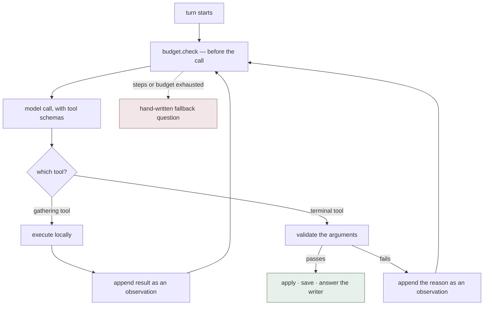

# The interview, as an agent

**Build plan — 2026-09-01.** Detailed for the interview only. Everything
downstream is a one-line sketch at the bottom and stays that way until the
interview loop actually works.

For what the current app does today, see [../claudecurrentflow.md](../claudecurrentflow.md).

---

## 1. What changes

Today `next_question()` sends one prompt and demands one JSON blob back doing
seven jobs at once: `guidance`, `suggestions`, `question`, `established`,
`critical_gaps`, `readiness`, `should_continue`. `interview.parse()` validates
all seven, and **if any one fails, all seven are discarded** and the identical
prompt is retried at temperature 0.9, up to three times, then falls back to a
hand-written question.

The agent version decomposes that into small decisions taken one at a time,
each individually checkable.

| | Today | The loop |
|---|---|---|
| Model calls per turn | 1, plus up to 2 blind retries | 4–5 purposeful ones |
| Bad output | whole turn discarded | one action rejected, reason fed back |
| Grafana ranking | called every turn, always | called when the model is unsure |
| Transcript | last 15 turns, always dumped in | model pulls what it needs |
| Stopping | a boolean among six other fields | an explicit `finish_interview` call |
| Facts | overwritten every turn | appended, with the turn they came from |
| Cost | unmeasured | per step, capped before each call |

---

## 2. The tools

Seven. Four gather or update state, three end the turn.

| Tool | Does | Terminal |
|---|---|---|
| `rank_shapes` | asks Grafana which kinds of question have produced writing | no |
| `search_answers` | searches everything the writer said, beyond the prompt window | no |
| `record_established` | stores one settled fact + its source turn | no |
| `assess_readiness` | updates readiness and the reason | no |
| `ask_question` | ends the turn with one question | **yes** |
| `offer_suggestions` | ends the turn with 2–3 selectable ideas and a question | **yes** |
| `finish_interview` | ends the interview | **yes** |

Two things to be clear about before building:

**These are internal Python functions, not APIs.** The model never executes
anything — it emits a structured request naming one, and the loop looks it up
and calls it. Only `rank_shapes` leaves the machine, and it is the expensive
one: it spawns the Grafana MCP server, roughly a second before any query runs.
Cache it for the length of a run.

**The three terminal tools do nothing.** They are typed return values wearing a
tool costume — a way to get validated structured output *and* let the model
signal which kind of response it chose, in one mechanism. They replace
`response_kind` and its sibling fields.

**Every step is a billed model call.** The model cannot run a tool and keep
thinking. It stops, the loop executes locally, then calls the model again with
the result appended — and the prompt grows each step, because the model is
stateless and the whole exchange is re-sent. That is the cost model, and it is
why `max_steps` is not optional.

---

## 3. The loop



```
run(project, tools, validate, max_steps=6, budget_cents=3):
    open an agent_run row and a recorder file
    send the prompt
    repeat up to max_steps:
        check the budget                     # before the call, not after
        call the model
        record the raw payload, verbatim
        for each tool call in the reply:
            if it is terminal:
                validate it
                if valid   -> apply, close the run, return
                if invalid -> write the rejection, hand back the reason, continue
            else:
                execute it, write the step, hand back the result
    fall back to a hand-written question and mark the run exhausted
```

It always terminates. `max_steps`, the budget, and the fallback mean a wedged
model still leaves the writer with something to answer.

---

## 4. Validation is the point

A rejection is not an error that kills the turn. It is handed back as the next
observation, so the model corrects itself with the reason in hand.

This is the "Give me options" bug in structural form. Today:

```
attempt 1: response_kind="question" → parse raises → discard everything
attempt 2: identical prompt, temp 0.9 → same mistake → discard
attempt 3: → discard
→ fallback question, no suggestions, "Vertex busy" shown to the writer
```

In the loop:

```
step 1: ask_question("What does he do next?")
        → rejected: "the writer pressed Give me options — call offer_suggestions"
step 2: offer_suggestions([three ideas])   ✓
```

Same cost as one wasted retry, and the model is told what was wrong instead of
re-rolling the dice.

The checks that carry over, after the no-assist rules came out on 2026-08-31:

- an options request must end with `offer_suggestions`
- a question must be non-empty and under ~320 characters
- a question may not repeat any of the last eight
- suggestions come 2–3 at a time, each with a label
- readiness is a number in [0, 1]

---

## 5. The harness around it

The agent is the loop. The harness is the bounded space it runs inside — and
most of it is already written.

| Piece | Purpose | State |
|---|---|---|
| Budget (`core/budget.py`) | cents per run, checked before each step | written, **not imported anywhere** |
| Recorder (`core/recorder.py`) | verbatim payloads, so replay costs nothing | written, **not imported anywhere** |
| Validation | rejects malformed actions | live, becomes the argument checker |
| Fallback | hand-written questions when the loop cannot finish | live |
| Involvement ceilings | 5 answers ai-led, 9 collaborative | live — a guard the model cannot argue with |
| Telemetry | Loki write, Grafana ranking read | live |

Budget and recorder are unwired because a single call needs neither. **A loop
needs both, and that is not a coincidence — they were written for this.**

One rule the ceilings must keep: an explicit options request outranks them.
That was the bug fixed on 2026-08-31, and it has to survive the rewrite.

---

## 6. What it stores

SQLite from the first row. No JSON files beside it — the split that is free
today stops being free the moment a screenplay scene needs a stable id.

| Table | Holds |
|---|---|
| `projects` | seed, format, involvement, readiness, status |
| `turns` | seq, focus, kind, question, answer, words, seconds, skipped |
| `suggestions` | the ideas offered on a turn, and which were chosen |
| `facts` | one settled fact per row, with the turn it came from |
| `agent_runs` | workflow, trigger, status, steps, cost, outcome |
| `agent_steps` | every tool call: arguments, result or rejection, tokens, cost |

`agent_steps` is what makes "why did it ask that?" answerable later from the
database alone.

---

## 7. What a prototype showed

A throwaway version of this was built and removed on 2026-09-01. Five findings
worth having before the real one:

1. **The model takes the cheapest path to ending its turn.** With the tool
   config set to force a call, the first version ran exactly one step every
   turn, called `offer_suggestions` every time, and recorded zero facts. The
   loop was working; the prompt was not. Splitting the turn into two explicit
   phases — settle what just happened, *then* end the turn — and marking the
   first phase non-optional moved it to 4–5 steps with facts and readiness
   updates on every turn.
2. **It will offer suggestions constantly unless told when to ask.** With the
   no-assist rules gone, "help freely" is unopposed. The prompt needs an
   explicit rule: offer when they are stuck or ask, otherwise ask.
3. **Replies can carry several tool calls at once** — three `record_established`
   in one reply was common. The reply is billed once, so the cost belongs to the
   reply, not to each call, or summing steps double-counts every parallel call.
4. **Observed cost: 0.07–0.22c per turn**, against roughly 0.02c for the single
   call. Real, and still cents; worth watching when the same loop reaches
   screenplay, where a pass is several calls per scene.
5. **Tests must not spawn the Grafana MCP subprocess.** An offline switch took
   the suite from 2.3s to 0.03s.

---

## 8. Done means

- The interview runs end to end on the loop, with `next_question()` kept as a
  fallback path behind a flag.
- A turn takes 2–5 steps and records the facts its answer settled.
- An invalid action is rejected and corrected within the same turn, and the
  rejection is visible in `agent_steps`.
- "Give me options" returns suggestions from any state, including past the
  involvement ceiling.
- Every run has a cost, a step count, and a recorder file.
- The suite runs offline.

## 9. Open questions

- Does `assess_readiness` earn its place as a separate tool, or should readiness
  ride along on the terminal calls?
- Should the writer see the steps as they happen, or only the result? A 5-step
  turn is 8–15 seconds of silence otherwise.
- `HTTPServer` is single-threaded, so a 5-step turn blocks every other request
  including static files. Move to `ThreadingHTTPServer` before or during?

---

## 10. Everything downstream — sketch only

Not designed yet. Each becomes the same loop with a different tool list, and
each gets its own document when the interview is done.

| Stage | What it would do |
|---|---|
| **Outline** | Turn the interview into 4–9 scenes. The first reuse of the loop, and the test of whether the tool list is really swappable. |
| **Screenplay** | Generate from the outline or import Fountain. Adds a runtime meter and stable scene ids — the first artifact anything downstream depends on. |
| **Breakdown** | Tag cast, locations, props, wardrobe, VFX per scene, traced back to the source text, human-confirmed. |
| **Schedule** | Group scenes into shoot days, detect conflicts, propose changes and show their consequences before applying. |
| **Shot list** | Coverage per scene: framing, movement, equipment, setup estimates, and what essential coverage is missing. |
| **Readiness** | Ready / at risk / blocked per shoot day, each blocker linked to the task that clears it. |

The pattern repeats across all six: the agent proposes, the harness bounds, a
human approves the consequential parts, and a change upstream marks everything
downstream stale.
