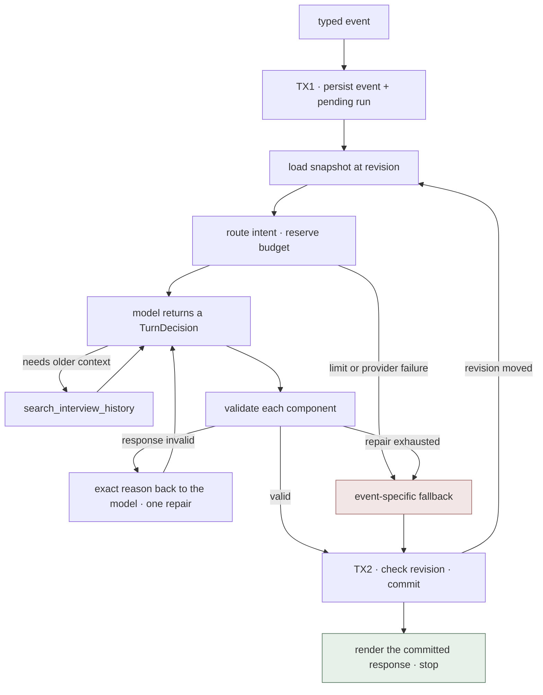

# The Interview, built from scratch

**Merged plan — 2026-09-01.** The architecture here is taken from
`codex-second-unit/CODEX_AGENTIC_FILM_HARNESS.md`, which is the better design on
every point where the two documents disagreed. What this adds is the measured
baseline from a working prototype, the failure mode that prototype actually hit,
and decisions on the questions the source document left open.

Scope: the Interview only. Nothing downstream is designed until a turn runs on
this loop.

## 0. Built from scratch means

New project, no imports from `app/` or `core/`. The current build stays running
and untouched while this one is proven.

What carries over, deliberately: the `.env` credentials, the Grafana/Loki stream
labels (so one series spans both builds), and the interview prompt as *text* to
be rewritten by hand — not imported.

What does not carry over: the JSON store, `next_question()`, the seven-field
response, the answer ceilings, and the model wrapper.

---

## 1. The constraints that shape everything

1. **The filmmaker is the authority.** Suggested → Accepted → Approved are
   distinct states. Nothing the model proposes becomes canon until the writer
   selects it.
2. **One event in, one visible response out, then stop.** The agent never talks
   to itself in the background.
3. **Deterministic where possible.** Routing, continuity, limits, persistence
   and validation belong to the harness, not to the model remembering to ask.
4. **No partial turns.** Either the response and its state changes commit
   together, or nothing does.
5. **The snapshot is the memory.** Not the model's context, not the browser.

---

## 2. Events

Every filmmaker action is a typed event with an idempotency key. Buttons send
events, never synthetic prose. This is the root fix for the "Give me options"
bug: the old build inserted a fake sentence — *"I'm not sure yet. Give me two or
three concrete possibilities"* — into the transcript as if the writer had typed
it, which inflated answer counts and polluted the history.

| Event | Payload |
|---|---|
| `interview_started` | idea, storytelling format, involvement mode |
| `message_submitted` | exact filmmaker text + the response it addresses |
| `suggestions_requested` | nothing — it does not pretend an answer was given |
| `suggestions_selected` | stable suggestion IDs + optional note |
| `suggestions_rejected` | rejected IDs + optional reason |
| `question_skipped` | the response ID being skipped |
| `continue_interview` | returns an outline-ready interview to Active |
| `decision_revised` | corrects or retracts an earlier answer or choice |

Every event carries `event_id`, `session_id`, `expected_session_revision`,
`kind`, `payload`, `created_at`. A repeated `event_id` returns the committed
response instead of running again.

`message_submitted` is deliberately not called "answer". The writer may be
answering, asking the editor something, correcting a misunderstanding, or giving
an instruction. The router classifies it; it never rewrites the text.

---

## 3. The snapshot

Assembled by the harness before every run, from SQLite:

- session revision and interview status
- the original idea, format, involvement mode
- the latest event and the last 3–5 completed turns
- active facts with their evidence
- suggestions and their status: shown, selected, rejected, superseded, undecided
- open gaps and any contradictions **already computed** against the new input
- the last eight questions asked
- readiness history with explanations
- a cached focus ranking, if one is fresh

The model spends no call discovering the current story. Older history is
reachable through one search tool when a decision genuinely depends on it.

---

## 4. The model contract: one `TurnDecision`

The normal path is **one model call** returning one object:

```text
TurnDecision
├── state_updates
│   ├── facts[]        text · source_event_id · evidence quote
│   ├── gap_changes[]  open | update | resolve · evidence
│   └── readiness      status · four-lens evidence · reason      (optional)
└── response
    ├── primary_intent ask | suggest | reflect | coach | recommend_outline
    ├── blocks[]       short reflection, coaching, or suggestion cards
    └── question       zero or one
```

A turn may legitimately contain no fact and no readiness change. That is the
correct outcome when an answer settles nothing, and it must not be penalised.

**Use a discriminated JSON schema, not native function calling.** Once state
updates are batched into one decision, the normal path returns a single
structured object — function calling buys nothing there, and it ties the design
to one provider. The only genuine tool is history search, which is a second call
by definition.

### Response intents and their controls

| Intent | Guardrail | UI controls |
|---|---|---|
| `ask_question` | one question, not a repeat, not compound | composer + **Send** |
| `offer_suggestions` | 2–3 stable cards, each with a dramatic consequence | checkboxes, **Use selected**, **None fit** |
| `reflect_and_confirm` | short interpretation; not canonical until confirmed | **Confirm**, **Correct**, **Add nuance** |
| `coach_writer` | answers the question asked; advice is not story fact | composer, **Continue** |
| `recommend_outline` | names readiness evidence | **Build outline**, **Keep developing** |

A reply may combine a short reflection or coaching block with suggestions and at
most one question. The primary intent decides the controls.

**One guard the source document lacks:** a non-question intent may not
immediately follow another non-question intent. Two reflections in a row means
the writer has answered twice and been asked nothing.

---

## 5. The loop



No database transaction is open while the model runs.

---

## 6. Validation

**Structural** — before anything is shown or saved:

- the event ID is new, or maps to an already-committed response
- the expected session revision still matches
- the intent is one the router allows for this event kind
- at most one question, and not a rephrasing of the last eight
- suggestions are 2–3 distinct cards, each explaining its effect
- selected and rejected IDs exist and belong to the response they address
- unselected suggestions appear nowhere in facts
- every fact cites a real event and quotes its evidence
- contradictions are surfaced, never silently resolved
- readiness names evidence per lens plus a reason
- no error, budget, or safety-limit language appears as creative guidance

**Behavioural** — the checks the prototype proved are needed, absent from the
source document. Structure passing is not the same as the agent doing its job:

- if the latest answer contains a concrete, checkable detail and
  `state_updates.facts` is empty, the turn is suspect — log it, and sample these
  in evaluation
- `offer_suggestions` on more than three consecutive turns, absent an explicit
  request, is a regression
- readiness that never moves across five turns is a broken evaluator, not a
  stable story

These are measurements, not hard rejections. The failure they catch is an agent
that satisfies the schema while doing nothing.

---

## 7. Partial failure — the open question, decided

The source document validates components independently but does not say what
commits when facts fail and the response passes. The rule:

1. Any component invalid → **one repair call**, with the exact reason, valid
   context retained.
2. On the repair, if `response` is valid but some `state_updates` are not:
   **commit the response, drop the invalid updates**, and record each drop on the
   run. A dropped fact is re-derivable from the same answer next turn; a lost
   response wastes the filmmaker's turn.
3. If `response` is still invalid → event-specific fallback.
4. Readiness is all-or-nothing. A partially valid readiness assessment is
   discarded and the previous one stands.

---

## 8. Fallbacks

A universal fallback question is wrong: if the writer pressed **Give me
options**, handing back a question reproduces the original bug one layer down.

| Failed event | Fallback |
|---|---|
| answer or skip | a local question from a different focus, or **Retry** |
| suggestions requested | locally prepared options, or **Retry** — never a question |
| direct question, correction, instruction | preserve the message, show **Retry** |
| selection or revision | preserve the pending event, show **Retry** — never partially apply |
| continue interview | return to Active with a local question or **Retry** |

Every fallback preserves the filmmaker's input and commits no story changes.

---

## 9. Commit

Two short transactions with the model call between them:

1. **TX1 — ingest.** Insert the immutable event and a pending run, protected by
   the idempotency key.
2. **Outside any transaction.** Load the snapshot, call the model, run local
   reads, validate everything in run-local memory.
3. **TX2 — publish.** Compare the expected revision; save the response,
   suggestions, facts, gaps, readiness, run result and telemetry outbox together;
   complete the event; increment the revision.

If the revision moved, discard the staged result and re-evaluate once against
fresh state. A crash between transactions leaves the event retryable and no
partial creative state visible.

---

## 10. Canon

**Facts are append-only with status.** Each carries text, source event, an
evidence quote, and Active / Superseded / Retracted. A correction supersedes
rather than overwrites — the old build's `established` array was replaced
wholesale every turn, so a fact could vanish because the model got terse.

**Suggestions have stable IDs** and a status: Shown, Selected, Rejected,
Superseded, Undecided. Selection is an event carrying IDs, never a prose copy of
the assistant's own words.

**Readiness has one canonical evaluator** and an append-only history. The model
proposes; only validated evidence changes the status.

**No answer ceilings.** The old 5/9 limits ended interviews on the writer's
behalf and produced the "safety limit" language that leaked into the UI.
Involvement changes how proactively the editor helps and how soon it recommends
an outline — never how many answers the filmmaker is allowed to give. Cost is
bounded per run, which is the correct place for it.

---

## 11. Leaving the interview

```text
Active → Ready for outline → Outline started
   ↑              │
   └──────────────┘  Keep developing
```

The agent calls `recommend_outline` when it can name who carries the film, the
pressure driving it, enough visible events to arrange, a plausible final image,
and no unresolved contradiction. That moves the status to **Ready for outline**
and shows two buttons. Only the filmmaker starts the Outline.

---

## 12. Data model

`interview_sessions` (revision, status) · `interview_events` (kind, payload,
idempotency key, lifecycle) · `assistant_responses` (typed blocks, addressed
event) · `suggestions` + `suggestion_selections` (stable IDs, status) ·
`story_facts` (evidence, source event, status) · `story_gaps` ·
`readiness_assessments` (append-only) · `agent_runs` + `agent_steps` ·
`telemetry_outbox`.

Run lifecycle is Pending → Running → Completed | Failed | Expired, with one
unexpired lease per session. **GET requests are read-only** and can never
advance the interview — the current build asks a new question on page load,
which means a refresh costs money and changes state.

---

## 13. Limits, with a measured baseline

From the prototype, on `gemini-2.5-flash`:

| | Measured |
|---|---|
| Cost, one model call | 0.064–0.080c |
| Cost, four model calls | 0.162–0.218c |
| Calls per turn | **1 to 4, nondeterministic for identical work** |

That variance is the finding that matters. The same prompt produced either one
reply carrying five batched actions or four sequential replies — 2 to 12 seconds
apart, with nothing to tell the writer which they were getting. The
`TurnDecision` exists to remove that variance.

Targets for one event:

- one model call on the normal path, one repair after a rejection
- four calls absolute ceiling, for retrieval or recovery only
- **p95 under 6 seconds** to a committed response
- cost stored in integer micro-USD with tokens, model version, prompt version
  and the price table used — cents are too coarse to see a regression

Concurrency: the request handler must be threaded. A single-threaded server
turns one 6-second turn into a stall for every other request, static files
included.

---

## 14. Harness versus agent

| The harness owns | The agent owns |
|---|---|
| snapshot assembly, event routing, continuity checks | what the film needs next |
| budgets, limits, wall-clock reservation | which intent serves the writer now |
| validation, repair, fallback selection | the question, the suggestions, the reflection |
| transactions, revisions, idempotency | readiness judgment, proposed |
| telemetry, recording | — |

The agent's callable surface is exactly one tool: `search_interview_history`.
Everything else is done *for* it. An agent that must remember to check
continuity will check it precisely when it is already suspicious, which is when
it is least needed.

---

## 15. Definition of done

- every action is a typed, idempotent event, safely retryable
- normal turns take one model call; the p95 target holds
- selected suggestions keep their identity; unselected ideas never enter canon
- every active fact has evidence and revision history
- options, skips, direct questions, corrections and continue each follow their
  own contract, including on failure
- the agent recommends an outline and never forces or forbids the transition
- active interviews survive a reload and resume without duplicating a turn
- provider, timeout, crash, duplicate-event and revision-conflict tests all
  preserve input and leave no partial state
- evaluations cover invention, semantic repetition, contradiction, suggestion
  usefulness, readiness evidence, and appropriate stopping

---

## 16. Build order

1. Schemas: event, `TurnDecision`, response blocks, fact, gap, readiness.
2. SQLite migrations and a repository. No other module writes SQL.
3. **Ten evaluation conversations before the loop** — repetition, contradiction,
   a vague answer, an explicit options request, a direct question, a correction.
   They are the spec; without them steps 4–5 cannot be shown not to regress.
4. The two-transaction harness: idempotency, snapshot, limits, repair, fallback,
   read-only GET. No prompt work yet.
5. The Story Editor on the one-call path, with behavioural checks wired in.
6. Structured UI events, resumable history, preserved pending input, and the
   working-state contract: show the event as Pending, keep the previous response
   visible, say "Considering your answer…" rather than replacing the question
   with an ellipsis.

## 17. Deferred

Voice input contracts, trace retention and privacy policy, external telemetry
consent, and the whole of Outline onward. All are in the source document and all
can wait until one turn has run end to end.
