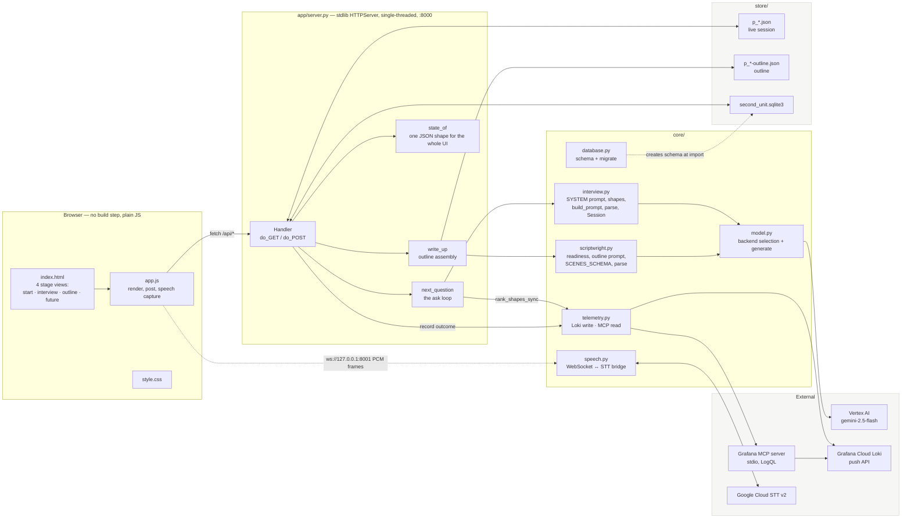
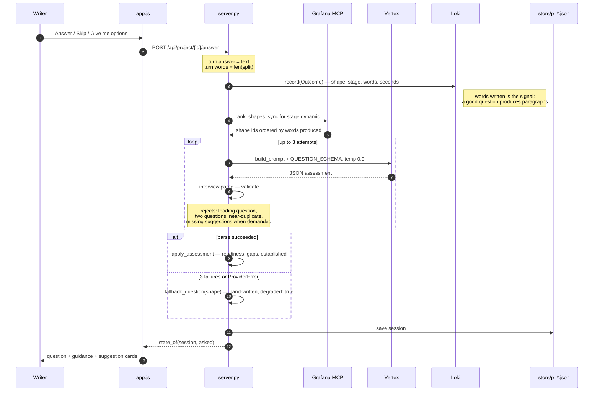
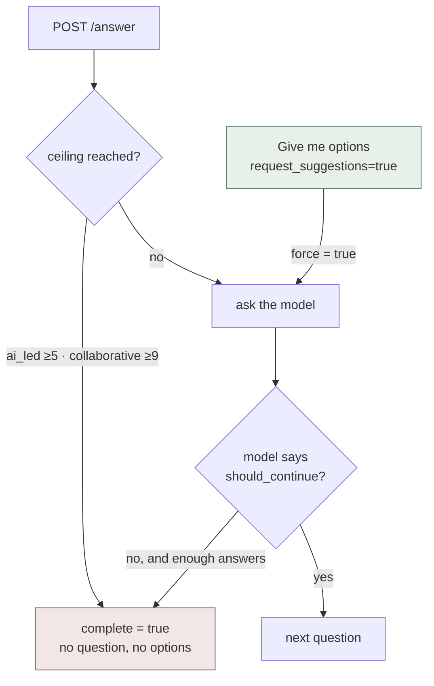
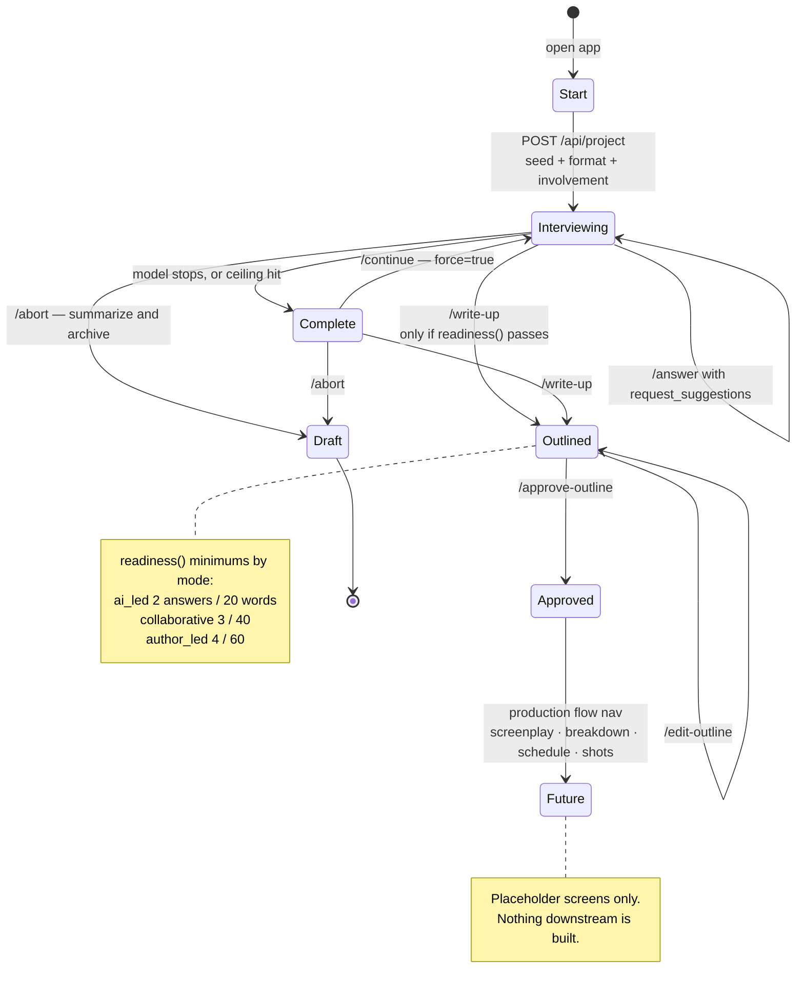
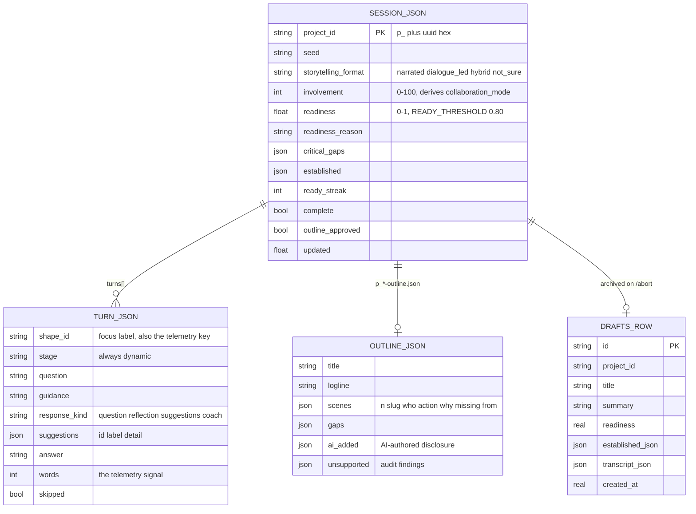
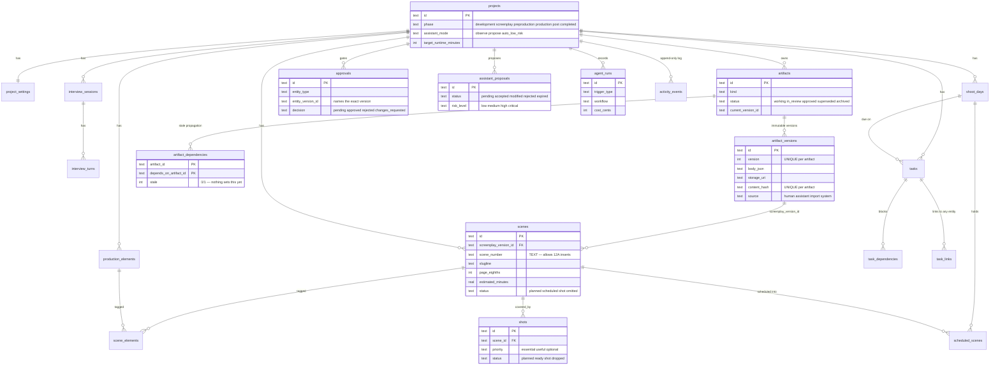

# Second Unit — current flow

**What is actually built and running, as of 2026-08-31 (branch `consolidate-architecture`).**

This is a description of the code as it stands, not the plan. Where the code and
`SCOPE.md` disagree, the code wins here — the gaps are listed at the bottom, and
they are the honest starting list for the Screenplay stage.

Rendered with Mermaid: VS Code previews it with the Markdown Preview Mermaid
extension, GitHub renders it natively.

---

## 1. System map

The one surprise in that picture: **`model.py` never talks to `telemetry.py`.**
Question quality and cost are measured through Loki, but the model call itself
is not instrumented — no token counts, no latency, no cost per turn.

---

## 2. The interview loop

Every writer action goes through the same shape: record what happened, ask
Grafana what has worked, ask Gemini for the next move, validate it hard, save.

### What can stop the loop

The green path is the fix from earlier today: an explicit options request sets
`force`, so it outranks both the ceiling and a completion the model calls on
that same turn. Without it, the button silently ended the interview.

---

## 3. Project lifecycle

---

## 4. Where state actually lives today

Three stores, split by accident of history rather than by design.

| Store | Path | Holds | Written by |
|---|---|---|---|
| Session files | `store/p_*.json` | the live interview, every turn | `save()` on every request |
| Outline files | `store/p_*-outline.json` | assembled outline | `write_up()`, `save_outline_edit()` |
| SQLite | `store/second_unit.sqlite3` | **only** the `drafts` table | `archive_draft()` on `/abort` |
| Loki | Grafana Cloud | one log line per answered question | `telemetry.record()` |

`drafts` is defined inline in [server.py:45-65](app/server.py#L45-L65), not in
`database.py`. It is the only table in the file that anything reads or writes.

---

## 5. The schema that exists but is idle

`core/database.py` provisions the full production schema at import and then
nothing touches it. This is the target the app has not migrated onto yet — and
the Screenplay stage is where it starts to matter, because `scenes` already
hangs off `screenplay_version_id`.

---

## 6. Wired vs. present-but-unused

| Piece | State |
|---|---|
| Dynamic interview, suggestions, dictation | **live** |
| Outline assembly, edit, approve | **live** |
| Drafts, history drawer | **live** |
| Loki telemetry write + MCP shape ranking | **live** |
| `database.py` production schema | created every boot, **never read or written** |
| `recorder.py` — verbatim trajectory capture | **not imported anywhere** |
| `budget.py` — pre-flight dollar caps | **not imported anywhere** |
| Screenplay, breakdown, schedule, shots, readiness | **placeholder screens only** |
| Import a screenplay | **not built** — the start-screen card is disabled |

### Consequences worth knowing before the next stage

1. **Two sources of truth.** Live projects are JSON files; the schema that
   everything downstream assumes is SQLite. Screenplay is the first artifact
   with real downstream consumers, so this is where the split stops being free.
2. **`HTTPServer` is single-threaded.** One Gemini call blocks every other
   request, including static files. A screenplay generation pass is far longer
   than a question — this will be felt.
3. **No cost or latency telemetry.** `budget.py` was written for exactly the
   case the screenplay stage introduces: a long, expensive pass where aborting
   halfway wastes everything already spent.
4. **`artifact_dependencies.stale` is unused.** Screenplay → breakdown is the
   first real edge. Proving the propagation once makes stages 3–6 nearly free.
